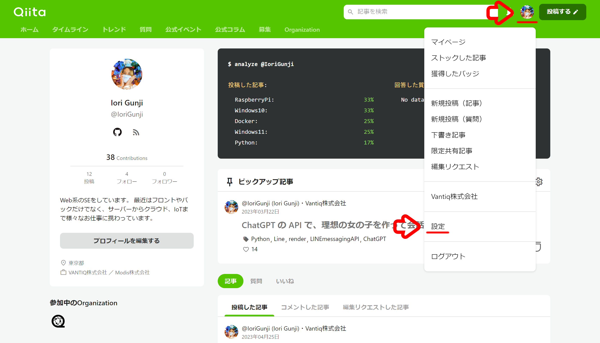
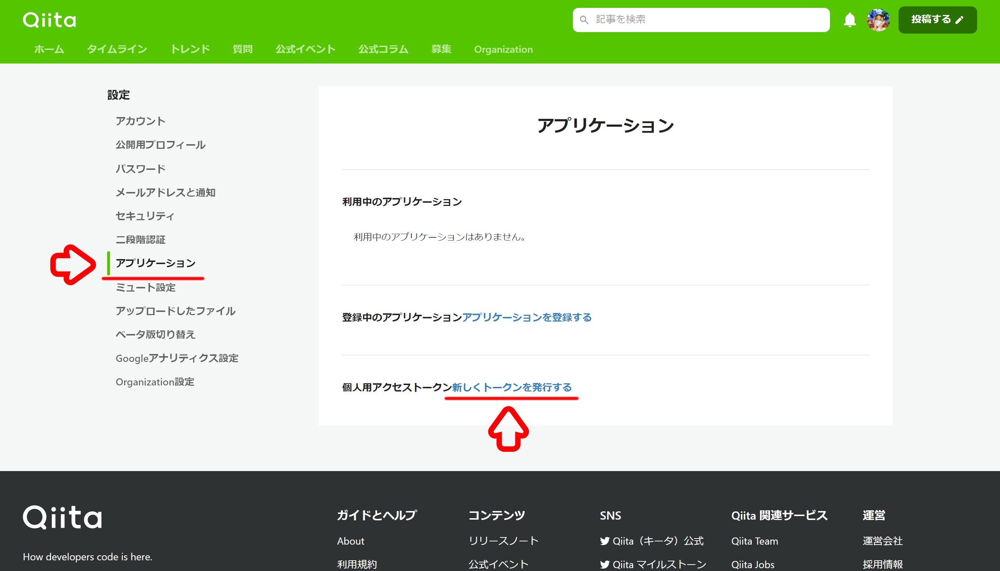
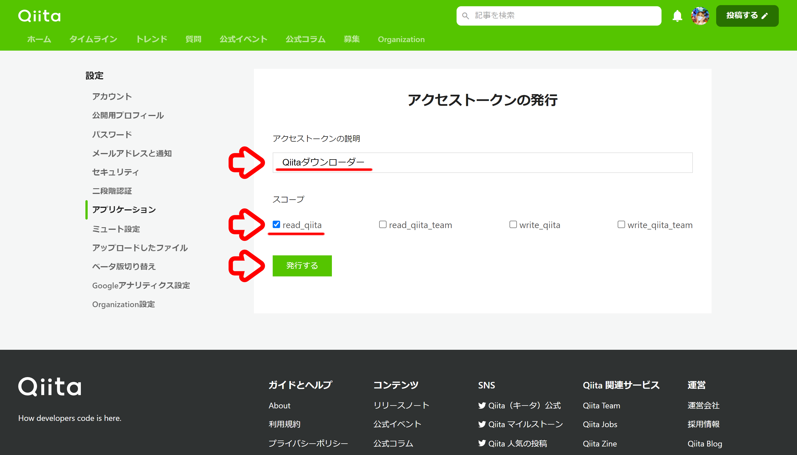
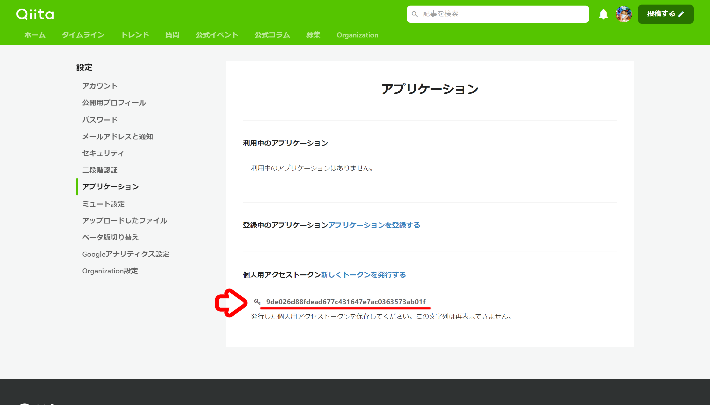
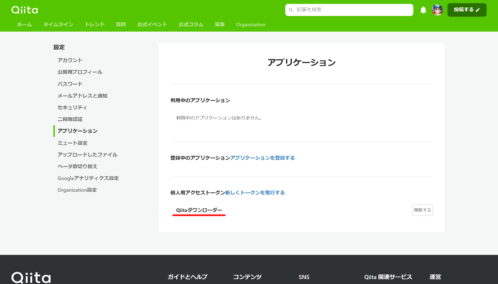
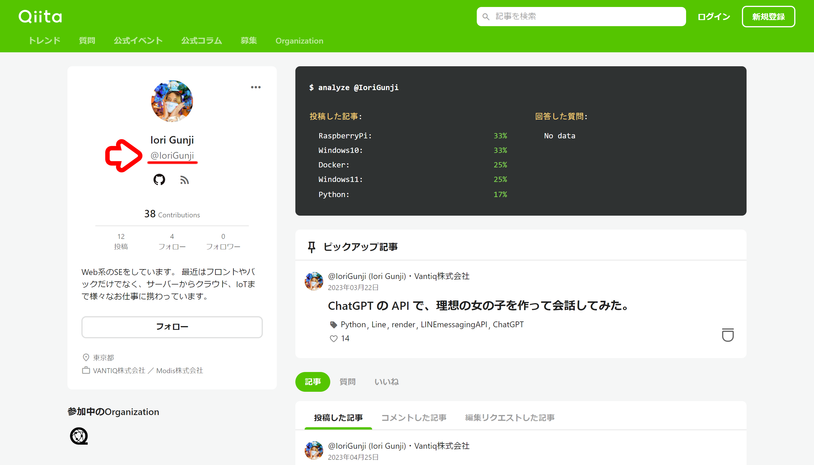
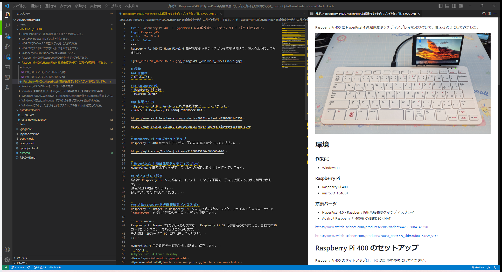

最近、 Qiita の記事を書くことが増えてきて、ふと思いました。  
何かの間違えで垢バンされたら、めっちゃヤバくね？と。  
と、いうことで Qiita に投稿した記事をダウンロードして保存する方法を考えました。  
ついで、他の人の記事もダウンロードできるようにしてみました。  
コピペでも動きますので、ぜひ試して見てください。  


# 環境
- ホストOS： Windows 11  
- Python： 3.9.13  

:::note info  
Python のバージョンについて  
今回、動作確認をしている Python のバージョンは `3.9.13` のみになりますが、基本的には他の近しいバージョンでも動作するはずです。  
ただし、型指定を行っている箇所や正規表現を用いている箇所でエラーが出る場合がありますので、ご注意ください。  
:::  


# Qiita API の利用
今回は下記のエンドポイントを利用します。  
- エンドポイント： `/api/v2/items`  
- メソッド： `GET`  

このエンドポイントは記事の一覧を作成日時の降順で取得できます。  
ただし、レスポンスとして返ってくるのは Markdown 形式のデータではなく、 HTML 形式のデータになります。  
そのため、ひと手間が必要でした。  

https://qiita.com/api/v2/docs#get-apiv2items  


## アクセストークンの取得

Qiita のアクセストークンを取得します。  

プロフィールアイコンをクリックして、 `設定` を選択します。  
  

`アプリケーション` をクリックし、 `新しくトークンを発行する` をクリックします。  
  

アクセストークンの説明を入力し、スコープは `read_qiita` を含めて、 `発行する` をクリックします。  
  

発行されたアクセストークンをコピーし、保存しておきます。  
  

:::note warn  
アクセストークンについて  
※ アクセストークンは画面遷移を行うと、下記の画像のように表示されなくなってしまうので注意してください。  
※ アクセストークンは他の人に公開したり共有しないでください。  
※ 記事内に記載されているアクセストークンは既に失効済みのものになりますが、分かりやすさのために隠さずに掲載しています。  

  
:::  


# Python スクリプトの作成
Python コードを作成します。  
また合わせて必要なパッケージのインストールを行います。  


## Python パッケージのインストール
今回は `Requests` を利用します。  
```  
pip install Requests  
```  


## Python コードの作成
Python のコードは下記のものを利用してください。  

なお、下記の定数は各自の環境に合わせて適宜変更してください。  
- TOKEN： 上記で発行した Qiita のアクセストークン  
- ENDPOINT： Qiita API のエンドポイント（基本的にはそのままで大丈夫です）  
- USER_LIST： ダウンロードしたい Qiita のユーザーID  
- URL_LIST： ダウンロードしたい Qiita 記事の URL  

定数の詳細は、 [定数の説明](#定数の説明) で解説しています。  

:::note info  
Qiita API のエンドポイントについて  
- qiita.com： Qiita のデータを利用する場合  
- *.qiita.com： Qiita Team のデータを利用する場合（ * は所属している Team の ID ）  

https://qiita.com/api/v2/docs#%E3%83%AA%E3%82%AF%E3%82%A8%E3%82%B9%E3%83%88  
:::  

```qiita_downloader.py  
import os  
import re  
import json  
from datetime import datetime  
from typing import Final  
import requests  

TOKEN: Final[str] = '9de026d88fdead677c431647e7ac0363573ab01f'  
ENDPOINT: Final[str] = 'https://qiita.com/api/v2/items'  

USER_LIST: Final[list[str]] = ['IoriGunji']  
URL_LIST: Final[list[str]] = ['']  


def main(user_list: list[str], token: str, endpoint: str, url: list[str]):  
    """Qiita記事の一覧を取得し、 .md ファイルとして各記事および画像をダウンロードします。  

    ユーザーID, アクセストークン, エンドポイントの全てが与えられている場合は、ユーザーが投稿している記事の一覧を取得し、ダウンロードを行います。  
    ダウンロードしたい記事のURLの配列が与えられている場合は、個別にダウンロードを行います。  
    なお、ユーザーID, アクセストークン, エンドポイント と URL の両方が与えられている場合は、その両方をダウンロードします。  

    Parameters  
    ----------  
    user_list : list[str]  
        ダウンロードしたいQiitaのユーザーIDの配列  
    token : str  
        Qiitaのアクセストークン  
    endpoint : str  
        Qiita API のエンドポイント  
    url : list[str]  
        Qiita記事のURLの配列  
        例：['https://qiita.com/IoriGunji/items/d84fd35e0da1b68ff7f5']  
    """  
    url_list = []  
    if len(user_list) and token and endpoint:  
        for user in user_list:  
            if user:  
                url_list.extend(get_article_list(user, token, endpoint))  
    if len(url):  
        url_list.extend(url)  
    get_md_files(url_list)  


def file_name_escape(name: str):  
    """ファイル名に利用できない文字をエスケープします。  

    Windows OS および Mac OS のファイル名で利用できない文字列を全角文字列に置換します。  
    半角スペースおよび全角スペースは削除されます。  

    Parameters  
    ----------  
    name : str  
        エスケープ処理をしたいファイル名  

    Returns  
    ----------  
    str  
        エスケープ処理されたファイル名  
    """  
    REGEX_PATTERNS = [  
        {'before': r'\\' , 'after': '￥'}  
        , {'before': r'\|' , 'after': '｜'}  
        , {'before': r'\.' , 'after': '-'}  
        , {'before': r':' , 'after': '：'}  
        , {'before': r'/' , 'after': '／'}  
        , {'before': r'\*' , 'after': '＊'}  
        , {'before': r'\?' , 'after': '？'}  
        , {'before': r'"' , 'after': '”'}  
        , {'before': r'<' , 'after': '＜'}  
        , {'before': r'>' , 'after': '＞'}  
        , {'before': r' ' , 'after': ''}  
        , {'before': r'　' , 'after': ''}  
        , {'before': r'%' , 'after': '％'}  
        , {'before': r'=' , 'after': '＝'}  
    ]  
    for regex in REGEX_PATTERNS:  
        name = re.sub(regex['before'], regex['after'], name)  
    return name  


def get_article_list(user_id: str, token: str, endpoint: str):  
    """Qiitaの記事一覧を取得します。  

    記事一覧の取得にはアクセストークンが必要になります。  
    限定共有記事も含めて取得します。  

    Parameters  
    ----------  
    user_id : str  
        QiitaのユーザーID  
    token : str  
        Qiitaのアクセストークン  
    endpoint : str  
        Qiita API のエンドポイント  

    Returns  
    ----------  
    list[str]  
        文字列型のURLの配列  
    """  
    headers = {  
        'Authorization': 'Bearer ' + token  
        , 'content-type': 'application/json'  
    }  
    payload = {  
        'page': 1  
        , 'per_page': 100  
        , 'query': 'user:' + user_id  
    }  
    response = requests.get(endpoint, headers = headers, params = payload)  
    url_list = [x['url'] for x in json.loads(response.text)]  
    return url_list  


def get_md_files(url_list: list[str], image_store: str = 'https://qiita-image-store', image_ext: list[str] = ['jpg', 'jpeg', 'png', 'gif', 'tif', 'tiff']):  
    """Qiitaの記事をダウンロードします。  

    Qiitaの記事を .md ファイルとしてダウンロードします。  
    また画像ファイルもダウンロードします。  
    ※タグ形式の画像には対応していません。  

    Parameters  
    ----------  
    url_list : list[str]  
        Qiita記事のURLの配列  
    image_store : 'https://qiita-image-store'  
        Qiita記事の画像が保存されているサーバーのホスト名  
    image_ext : ['jpg', 'jpeg', 'png', 'gif', 'tif', 'tiff']  
        ダウンロードする画像の拡張子  
    """  
    # 画像検索用の正規表現の作成
    regex = [f'\!\[(.*)\].*({image_store}.*{ext})' for ext in image_ext]  
    # 記事データ保存用の現在日時のフォルダ作成
    current_dir = os.getcwd()  
    root_dir_name = datetime.now().strftime('%Y%m%d_%H%M%S')  
    root_dir_path = os.path.join(current_dir, root_dir_name)  
    os.mkdir(root_dir_path)  
    # 記事データの分だけループ
    for url in url_list:  
        if not url:  
            continue  
        # 記事データの取得
        response = requests.get(url + '.md')  
        md_text = response.text  
        # 記事名の取得
        md_title = re.search(r'(?<=title:).*(?=\n)', md_text).group().strip()  
        escaped_title = file_name_escape(md_title)  
        # 保存フォルダの作成
        article_dir_name = escaped_title  
        article_dir_path = os.path.join(root_dir_path, article_dir_name)  
        os.mkdir(article_dir_path)  
        # 画像URLの取得
        image_info_list = []  
        for reg in regex:  
            image_info_list.extend(re.findall(reg, md_text))  
        # 画像が存在する場合のみ
        if len(image_info_list):  
            # 画像のディレクトリの作成
            image_dir_name = 'image'  
            image_dir_path = os.path.join(article_dir_path, image_dir_name)  
            os.mkdir(image_dir_path)  
            # 画像の分だけループ
            for image_info in image_info_list:  
                # 画像のダウンロード
                image_url = image_info[1]  
                image_name_tuple = os.path.splitext(image_info[0])  
                image_name = file_name_escape(image_name_tuple[0]) + image_name_tuple[1]  
                image_absolute_path = os.path.join(image_dir_path, image_name)  
                response = requests.get(image_url)  
                image_data = response.content  
                with open(image_absolute_path, "wb") as file:  
                    file.write(image_data)  
                    file.flush  
                # 記事データの画像リンクの書き換え
                image_path = os.path.join(image_dir_name, image_name)  
                md_text = md_text.replace(image_url, image_path)  
        # 記事データの整形
        md_array_before = md_text.splitlines()  
        md_array_after = []  
        meta = 0  
        for md_line in md_array_before:  
            md = md_line.rstrip()  
            if meta < 2:  
                if re.match(r'^-{3}$', md):  
                    meta += 1  
            elif re.match(r'^\s*#.*$', md):  
                pass  
            elif re.match(r'^$', md):  
                pass  
            elif 0 < len(md):  
                md += '  '  
            md_array_after.append(md)  
        md_text = '\n'.join(md_array_after)  
        # 記事データの保存
        md_name = escaped_title + '.md'  
        md_path = os.path.join(article_dir_path, md_name)  
        with open(md_path, 'w', encoding='utf-8') as file:  
            file.write(md_text)  
            file.flush  


if __name__ == "__main__":  
    main(USER_LIST, TOKEN, ENDPOINT, URL_LIST)  
```  


# Qiita 記事のダウンロード
上記で作成した Python スクリプト（qiita_downloader.py）の定数を設定し、実行します。  


## 定数の説明
定数の詳細は下記のとおりです。  


### TOKEN
上記で発行した Qiita のアクセストークンを設定します。  
文字列型で設定します。  
記事内のコードに記載されているアクセストークンは失効しているため、必ず変更してください。  

```python:TOKENのサンプル  
TOKEN: Final[str] = '9de026d88fdead677c431647e7ac0363573ab01f'  
```  

### ENDPOINT
Qiita API のエンドポイントを設定します。  
文字列型で設定します。  
基本的にはそのままで大丈夫です。  

なお、 `*.qiita.com` のエンドポイントはテストしていません。  
動作するかわかりませんのでご了承のほどよろしくお願いします。  

```python:ENDPOINTのサンプル  
ENDPOINT: Final[str] = 'https://qiita.com/api/v2/items'  
```  

### USER_LIST
ダウンロードしたい Qiita のユーザーIDを設定します。  
文字列型の配列で設定します。  
複数のユーザーを設定することも出来ます。  

Qiita のユーザーIDは URL やプロフィール欄から確認できます。  
※ `@` マークは不要です。  
  

```python:USER_LISTのサンプル  
USER_LIST: Final[list[str]] = [  
    'IoriGunji'  
    , 'Qiita'  
]  
```  

### URL_LIST
ダウンロードしたい Qiita 記事の URL を設定します。  
文字列型の配列で設定します。  
複数の URL を設定することも出来ます。  

```python:URL_LISTのサンプル  
URL_LIST: Final[list[str]] = [  
    'https://qiita.com/IoriGunji/items/d84fd35e0da1b68ff7f5'  
    , 'https://qiita.com/Qiita/items/c686397e4a0f4f11683d'  
]  
```  

### 備考
`USER_LIST` と `URL_LIST` は、いずれかの設定もしくは両方の設定が必要です。  
両方設定した場合は、どちらともダウンロードされます。  


## ダウンロード完了
ダウンロードが完了すると、 Python スクリプトを実行したカレントディレクトリに、 `実行日のディレクトリ` が作成されて、その中にダウンロードされます。  
記事はタイトルごとにフォルダ分けされ、 `Qiita記事タイトル.md` というファイル名で保存されます。  

Qiita 記事内に画像ファイルがアップロードされている場合は、画面もダウンロードされて、 `image` フォルダに保存されます。  
また、 Markdown ファイル内の画像リンクも差し替えられます。  

  

:::note warn  
ダウンロードされる画像について  
ダウンロードされる画像は `` の形式のみ対応しています。  
`` タグ形式の画像には対応していませんので、ご注意ください。  

また、デフォルトの設定では URL が `https://qiita-image-store` から始まるファイルで、画像の拡張子が現在 Qiita で表示可能な `jpg` `jpeg` `png` `gif` `tif` `tiff` のいずれかの場合のみダウンロードされるようになっています。  
変更したい場合は、  
```python  
def get_md_files(url_list: list[str], image_store: str = 'https://qiita-image-store', image_ext: list[str] = ['jpg', 'jpeg', 'png', 'gif', 'tif', 'tiff'])  
```  
を呼び出している箇所で、引数に値を渡すか、デフォルト値を変更してください。  
:::  

# 参考文献
下記のサイトを参考にさせて頂きました。  

https://qiita.com/api/v2/docs  


<!-- EOF -->  
