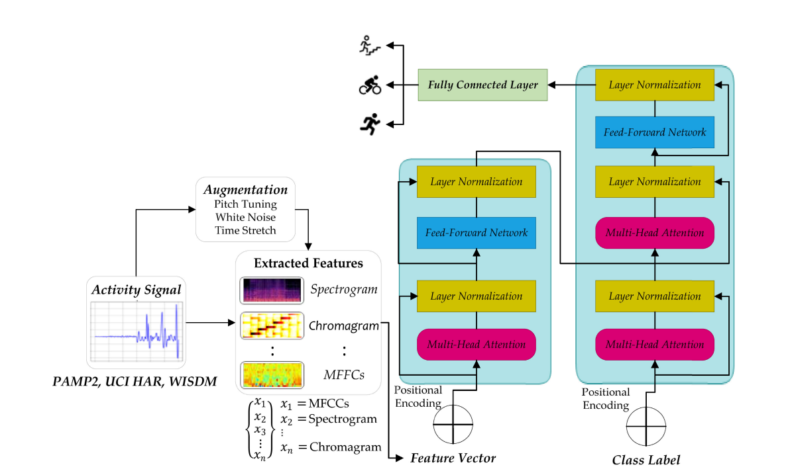
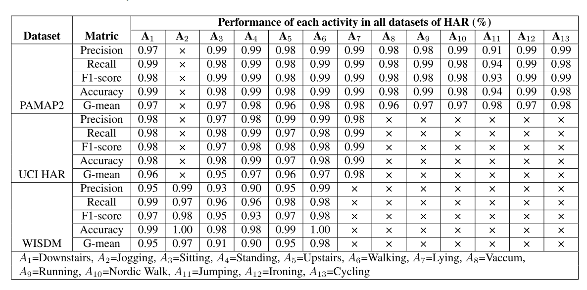

# An Efficient Human Activity Recognition Using Hybrid Features and Transformer Model
2023/9/12に出た論文で音声に行う処理をWISDMデータセットに行った。  

具体的には  
* Tonnetz representation：音程ネットワーク表現(dim=6)  
* Mel-spectogram：高速フーリエ変換、フィルタ、対数(dim=128)  
* Spectral contrast：周波数の差分(dim=7)  
* Chromagram：周波数のまとまりでグループ化、対数(dim=12)  
* MFCCs：フィルタ、対数、余弦波変換(dim=40)  
* delta MFCCs：上の差分(dim=40)  
* delta delta MFCCs：上の差分(dim=40)  
に変換している。  

アーキテクチャは以下のような形  
  

  

優位性については、この論文での「座る」「立つ」の識別確率が90-93%と、ボトルネックになっている点である。  

## 元論文

https://ieeexplore.ieee.org/abstract/document/10247518  
