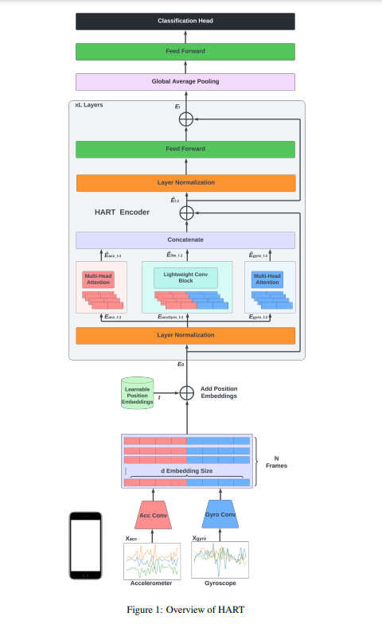

# Lightweight-Transformer-Models-For-HAR-on-Mobile-Devices

2022/9月に発表されたマルチモーダルなインプットのTransformerの論文。  
被引用数は3。  
（Data Augmentationについての論文で、あまり直接の関係はなさそうな引用であった。）  

モデルのアーキテクチャは以下の通り。  

  

処理の流れとしては、  

- 入力データはスマートフォンから回収した加速度と角速度データ合計の合計6軸  
- データを加速度、角速度それぞれに畳み込みでNチャンネルに変換しFlattenする  
- 学習可能な位置エンコーディングを施す  
- PreNormalization型のTransformerをL回作用させる  
- Global Average Poolingを作用させる  
- FFNを作用させる  
- Classificationの形式に沿った変換をする  

## ソースコード
https://github.com/getalp/Lightweight-Transformer-Models-For-HAR-on-Mobile-Devices  

## 元論文
https://arxiv.org/pdf/2209.11750.pdf  
