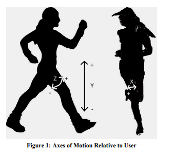
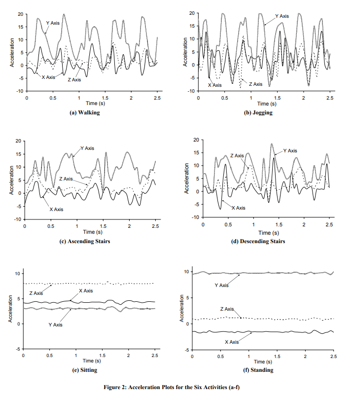

WISDMデータセットについて理解を深めるために勉強した内容をまとめておく。  

## データダウンロード
はじめに公式にWISDMデータセットをダウンロードする方法について。  
Kaggleからダウンロードしたが、以下のサイトからダウンロードするのが正規ルートのようだ。  

https://www.cis.fordham.edu/wisdm/dataset.php  

## readme.txt
ダウンロードした際に添付されていたreadme.txtには「When sharing or redistributing this dataset, we request that this readme.txt file is always included. 」と記載されている。  
つまり、このデータを共有する際にはこのreadme.txtを必ず添付することということのようだ。  
しかし、Kaggleなどの利用例を確認するとreadme.txtの記載されていない。これはいけない。  
急いで自分のGitHubにはreadme.txtを追加しておいた。  

また、readme.txtによるとこのデータセットを用いる際には以下の論文を引用することと記載されている。  

https://www.cis.fordham.edu/wisdm/public_files/sensorKDD-2010.pdf  

閑談はこのぐらいにしてデータの中身について話を進める。  

## WISDM_Act_v1.1_raw_about.txt

「measured by the android phone's accelerometer」と記載されていた。  
つまり、このデータセットは2010年に携帯電話を用いて人の状態と加速度を取得し、集めたものである。  

| Actiity     | Counts  | Percentage |  
|-------------|---------|------------|  
| Walking     | 424,400 | 38.6%      |  
| Jogging     | 342,177 | 31.2%      |  
| Upstairs    | 122,869 | 11.2%      |  
| Downstairs  | 100,427 | 9.1%       |  
| Sitting     | 59,939  | 5.5%       |  
| Standing    | 48,395  | 4.4%       |  
|             |         |            |  
| Total       |1,098,207| 100.0%     |  

クラスは合計6種類で、欠損値はなし。  
36人のからデータを取得している。  

サンプリングレートは20Hzである。  
つまり、1サンプルあたり50ms(0.5秒)である。  
さらに、1データあたり80サンプルであることから1データは約4秒であることがわかる。  

縦軸について、-20m/s^2から20m/s^2の値をとる。  

データ感として以下の動画が参考になった。  

https://www.youtube.com/watch?v=8gQeQW04x6o&t=157s  

また、この情報には重力を含んでいるため、縦軸には約10程度のバイアスが加わると記載されている。  

## Activity Recognition using Cell Phone Accelerometers

WISDMデータを使った場合に引用することと記載されていた論文。  
2010年に発表されており、被引用数は3082回であった。  

以下の画像はxyz軸の内訳。  
「in their front pants leg pocket」と記載されており、前ポケットにスマホを入れたとわかる。  
ｘ軸は進行方向に垂直な方向、ｙ軸は太腿に対して垂直方向、ｚ軸は進行方向である。  

  

軸について、注意する点としては、軸が地面ではなく人間の太ももの向きであるため座った場合にはｚ軸に重力加速度が加わる点だ。  
以下の画像と突き合わせて見てほしい。  
座っている状態はあくまでわかりやすい例であり、他の状態でも常にｙ軸にのみ重力加速度が加わっているわけではない。  
つまり単純にｙ軸のバイアスを除去しようとしてｙ軸の値全てにマイナス10をしても意味はないだろう。  

  

ラベルの6つの状態は識別が簡単そうなものを選んだと記載されている。  

それぞれの識別のための特徴について2.3節から得られた情報をまとめる。  

まず、sitとstandの2種類は他4種類と明らかに異なっており、ｘｙｚ軸それぞれあまり動きがない。  
また、sitとstandそれぞれについてもsit状態ではｚ軸の数値がコンスタントに大きく、stand状態ではｙ軸の数字がコンスタントに大きいという違いがある。  

他の4つについては、  
walkは1/2秒の周期でピークがあり、ｘ軸は他のｙｚ軸より常に小さい値をとっている。  
jogは1/4秒の周期でピークが存在し、ｙ軸について負の値がwalkより顕著である。  
downではｙ軸の加速度が小さく、1/2秒の周期がある。  
upではｙｚ軸に3/4秒の周期があり、これは足の進みが他より遅いことを表している。  

「J48（決定木モデル）」、「Logistic回帰」「MLP」の3つの機械学習モデルを作成して推論を行った結果によると、歩く、昇る、降りるの識別が難しいようだ。  
また、なかでも昇る、降りるの識別が誤検知が多いと記載されていた。  

以上がWISDMデータセットについて学んで得られた知見である。  
