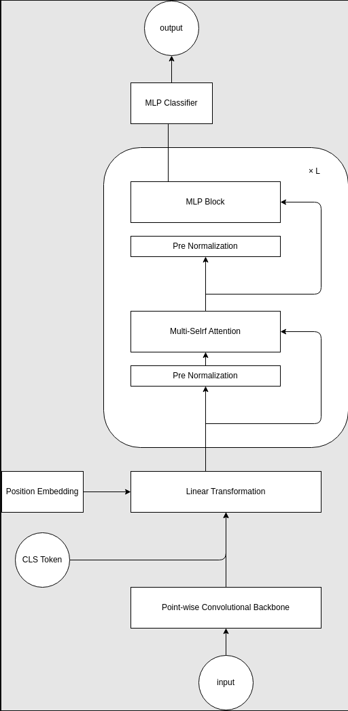
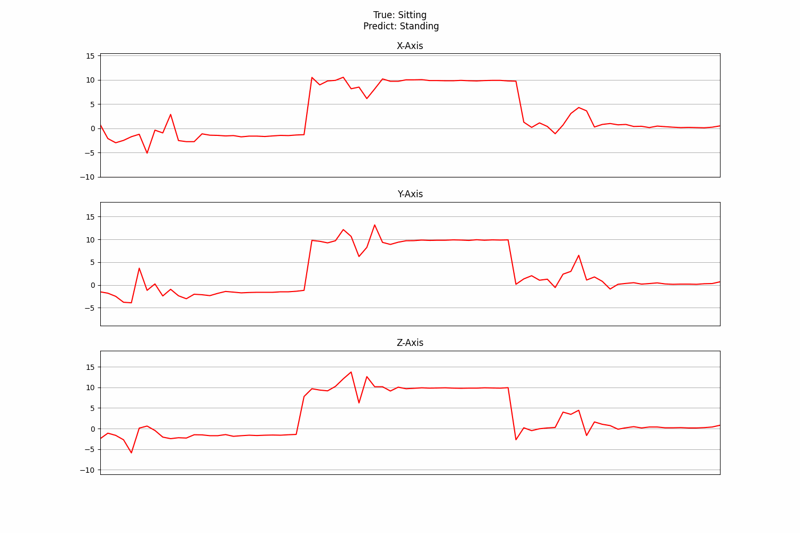
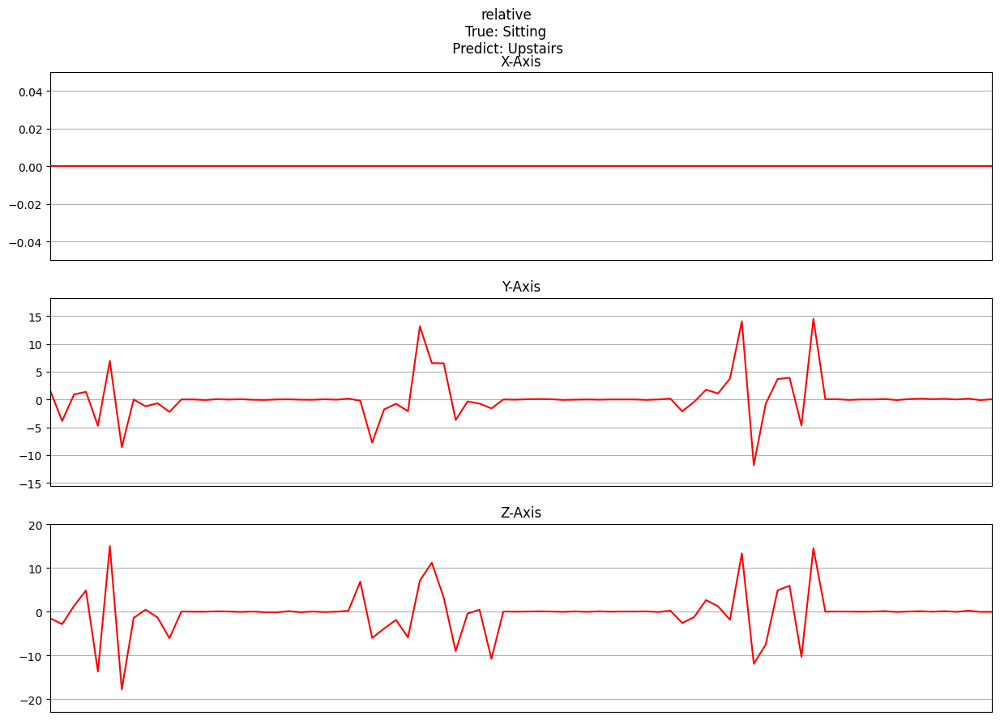
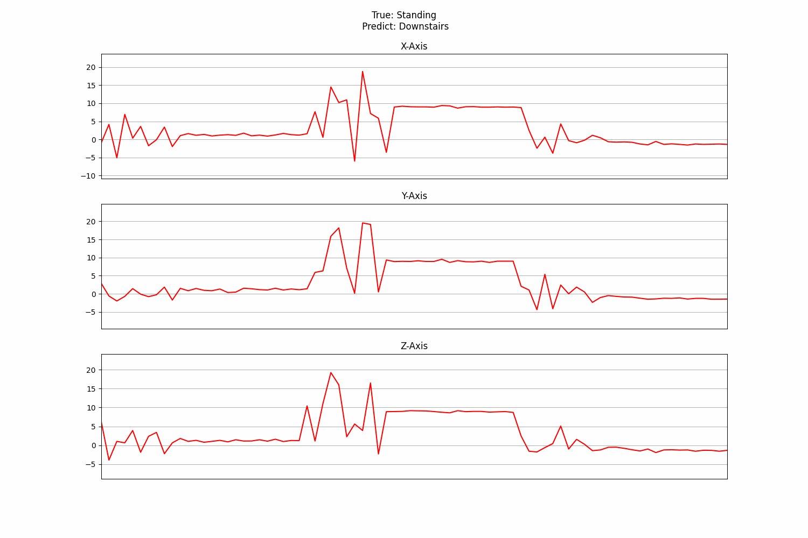
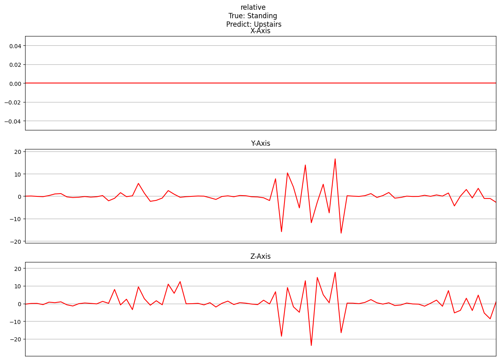

# HumanActivityRecognition -WISDM dataset-

# 目次
[概要](#概要)  
[データセット](#データセット)  
[モデル・評価方法](#モデル・評価方法)  
[結果](#結果)  
[工夫した点](#工夫した点)  
[試したこと](#試したこと)  
[誤分類したデータについて](#誤分類したデータについて)  
[ソースコード](#ソースコード)  
[参考文献](#参考文献)  
[補足情報目次](#補足情報目次)  

# 概要

Transformerの利用方法とより良いモデルの作成方法を体系的に学ぶことを目的とする。  
題材としては、WISDMデータセットを用い、人間の行動認識を行う。  
WISDMデータセットは、携帯電話から収集した加速度センサーのデータである。  
行動の種類としては「立つ」「歩く」「走る」「上り階段」「下り階段」「座る」の6種類。  
これらの行動状態をTransformerを用いて精度良く予測することが今回の目的である。  
結果としてSoTAは達成できていない。  
しかし、他Transformerモデルと比較しても遜色のないモデルを作成することができた。  

# データセット

WISDM(Wireless Sensor Data Mining)datasetは2010年に携帯電話を用いて人の行動状態と加速度を取得し、集めたデータセット。  

ラベルとして、以下の6つの行動状態と36人分の人間のIDがある。  

| Actiity     | Counts  | Percentage |  
|-------------|---------|------------|  
| Walking     | 424,400 | 38.6%      |  
| Jogging     | 342,177 | 31.2%      |  
| Upstairs    | 122,869 | 11.2%      |  
| Downstairs  | 100,427 | 9.1%       |  
| Sitting     | 59,939  | 5.5%       |  
| Standing    | 48,395  | 4.4%       |  
|             |         |            |  
| Total       |1,098,207| 100.0%     |  

今回はこの6つの行動状態を目的変数とする。  

入力データについて、  
データは時系列データであり  
サンプリングレートは20Hzである。  
加えて、1データあたり80サンプル存在することから、1データは約4(80/20)秒である。  

つまり、加速度計から取得した4秒間のデータから人間の行動を予測するタスクであると言い換えることができる。  

また、加速度データはx,y,zの3軸を持っており、それぞれ以下の画像の軸方向を持つ。  

  

値について、-20m/s^2から20m/s^2の範囲をとる。  
これには重力を含んでいるため、常に鉛直方向に約10m/s^2程度のバイアスが加わる。  
しかし、画像の軸のとり方からわかるように常にｙ軸にのみ重力加速度が加わっているわけではない。  
つまり、単純にｙ軸の値全てにマイナス10をしても重力加速度は無視できない。  

  

次に、上記の画像から推察できるそれぞれの行動状態についての特徴をまとめる。  

まず、「座る」と「立つ」の2種類は他4種類と明らかに異なる。  
「座る」「立つ」にはｘｙｚ軸すべてコンスタントな値をとる。  
また、「座る」と「立つ」についても「座る」状態ではｚ軸の数値が大きく、「立つ」状態ではｙ軸の数字が大きいという違いがある。  
これは前述の重力加速度の影響だろう。  

他の4つについては、  
「歩く」は1/2秒の周期でピークがあり、ｘ軸は他のｙｚ軸より常に小さい値をとっている。  
「走る」は1/4秒の周期でピークが存在し、ｙ軸について負の値が「歩く」より顕著である。  
「下り階段」ではｙ軸の加速度が小さく、1/2秒の周期がある。  
「上り階段」ではｙｚ軸に3/4秒の周期があり、これは足の進みが他より遅いことを表している。  

# モデル・評価方法

### 評価方法

- ACC(Accuracy)：正答率  
- RCL(Recall)：再現性（見落率）  
- PRC(Precision)：特異性（的中率）  
- F1-Score：RCLとPRCの調和平均  

### モデル
- 1-Dimensional Vision Transformer(ViT)  
- Conv.backbone Transformer(convbbt)  
- 1-Dimensional Convolutional Neural Network(1DCNN)  

1DCNNは手元で再現可能な比較用。  
以下のKaggleノートブックより入手した。  

https://www.kaggle.com/code/paulopinheiro/human-activity-recognition-1d-cnn  

現行のモデルでのSoTAはRNNとCNNを組み合わせたBiLSTM-CNNでACCが97.31%(3.7.1. Performance on WISDM Datasetより)  
データ拡張手法(SMOTE:kNNを用いた手法)を用いた場合ではConfomerがACC98.1%(4. Results and Discussion Table3より)  

また、ViTとconvbbtの違いはTransformerに入力するまでの情報の処理である。  
ViTはxyz軸を柵状に等間隔で切り出しそれぞれをアフィン変換して入力としているのに対して、convbbtでは1DCNNを用いて3チャンネルの入力を任意のチャネルに変換し、線形変換を行ったものを入力とする。  

どちらもPythonを用いて実装しており、1DCNNについてはTensorflow(google), ViT,convbbtについてはPytorch(meta)を使用した。  

### Vision Transformerでの処理
固定長80のスペクトルデータについてパッチサイズPにチャンネルごと柵状に分割  
柵ごとにチャネルを結合し、80×3から(3×P) × (80/P)の系列データに変換  
（以後、N = 80 / Pとする）  
(3×P) × Nの系列データをD×Nの系列データにアフィン変換  
出力の素となるCLSトークンを加えD×(N+1)の系列データにする  

### Conv．Backbone Transformerでの処理

  

Conv．Backboneでは、4層の点単位畳み込み層（活性化関数はGERU）で埋め込みを行う。  
点単位畳み込み層は入力が3次元のFFNを作用させているとも解釈することができる。  
ViTと同様にCLSトークンを加え、位置エンコーディングとして学習可能な埋め込みを行う。  
Conv.backboneで計算後に線形変換を行うことで任意の次元、チャンネル数でTransformerに入力することができる。  

# 結果
### 1-Dimensional Vision Transformer

https://github.com/rakawanegan/humanactivityrecognition_portfolio/blob/master/result/0726_optuna_vit1d_0/processed/lab_notebook.md  

  
| 1dvit | precision | recall | f1-score | support |  
| --- | --- | --- | --- | --- |  
|  |  
| Downstairs | 0.80 | 0.66 | 0.72 | 755 |  
| Jogging | 0.95 | 0.97 | 0.96 | 2586 |  
| Sitting | 0.94 | 0.89 | 0.92 | 461 |  
| Standing | 0.82 | 0.94 | 0.87 | 352 |  
| Upstairs | 0.83 | 0.77 | 0.80 | 917 |  
| Walking | 0.95 | 0.98 | 0.96 | 3166 |  
|  |  
|  accuracy || | 0.92 | 8237 |  
| macro | avg | 0.88 | 0.87 | 0.87 | 8237 |  
| weighted | avg | 0.92 | 0.92 | 0.92 | 8237 |  

Model size： 42 MB  
Execution time： 13 min 30 sec  

### Convolutional backbone Transformer

https://github.com/rakawanegan/humanactivityrecognition_portfolio/blob/master/result/0911_convbbt_4/processed/lab_notebook.md  

  
| convbbt | precision | recall | f1-score | support |  
| --- | --- | --- | --- | --- |  
|  |  
| Downstairs | 0.85 | 0.89 | 0.87 | 755 |  
| Jogging | 0.98 | 0.98 | 0.98 | 2586 |  
| Sitting | 0.99 | 0.99 | 0.99 | 461 |  
| Standing | 0.99 | 0.98 | 0.98 | 352 |  
| Upstairs | 0.86 | 0.83 | 0.84 | 917 |  
| Walking | 0.97 | 0.97 | 0.97 | 3166 |  
|  |  
|  accuracy || | 0.95 | 8237 |  
| macro | avg | 0.94 | 0.94 | 0.94 | 8237 |  
| weighted | avg | 0.95 | 0.95 | 0.95 | 8237 |  

Model size： 10 MB  
Execution time： 9 min 13 sec  

### 1-Dimensional Convolutional Neural Network

https://github.com/rakawanegan/humanactivityrecognition_portfolio/blob/master/result/0921_cnn1d_tf_0/processed/lab_notebook.md  

  

| 1dcnn | precision | recall | f1-score | support |  
| --- | --- | --- | --- | --- |  
|  |  
| Downstairs | 0.82 | 0.88 | 0.85 | 755 |  
| Jogging | 0.97 | 0.97 | 0.97 | 2586 |  
| Sitting | 0.99 | 0.98 | 0.99 | 461 |  
| Standing | 0.97 | 0.96 | 0.97 | 352 |  
| Upstairs | 0.87 | 0.81 | 0.84 | 917 |  
| Walking | 0.98 | 0.98 | 0.98 | 3166 |  
|  |  
|  accuracy || | 0.95 | 8237 |  
| macro | avg | 0.93 | 0.93 | 0.93 | 8237 |  
| weighted | avg | 0.95 | 0.95 | 0.95 | 8237 |  

Model size： 2.67 MB  
Execution time： 3 min 38 sec  

# 工夫した点

### 適切なEarly Stoppingをかける
3回連続で学習が悪化していた場合をEarly Stoppingを行う条件とし、悪化する前のモデルを最終モデルとして採用するように設定した。  
Early Stoppingをかけないと学習させ続けても精度向上は見られない上に学習時間が大幅に伸びてしまう。  

### ハイパーパラメータの最適化の方法としてOptunaを使用
Optunaとは、ベイズ推定を用いたハイパーパラメータの最適化を自動化するためのフレームワークである。  
グリッドサーチやランダムサーチよりも効率的にハイパーパラメータ探索空間を探索することができ、探索時間を短縮することができる。  
また、ハイパーパラメータの重要度・探索結果も可視化することができる。  

### バッチサイズをハイパーパラメータの探索空間から排除する
googleの提供している[tuning_playbook](https://github.com/google-research/tuning_playbook)によると、バッチサイズは学習速度に関係するパラメータであり、どのバッチサイズにおいても同様な最適解が得られるはずだということ。  
ハイパーパラメータを減らすことでより探索空間を網羅出来ると考え、今回探索空間からバッチサイズは除去した。  
バッチサイズは128で固定している。  

# 試したこと

### 重複を許して等確率で学習させる
Pytorchのtorch.utils.data.WeightedRandomSamplerを用いて行った。  
ACC=28.1%でありランダムに予測するよりはマシ程度でうまく作用しなかった。  

| Activity   | Downstairs | Jogging | Sitting | Standing | Upstairs | Walking     |  
|------------|------------|---------|---------|----------|----------|-------------|  
| Weight 　　 | 0.1333     | 0.1333　| 0.1333　 | 0.1333  | 0.1333  | 0.1333       |  

### 間違いの多いデータを重点的に学習させる
同上。ACC=32.0%  

| Activity  | Downstairs | Jogging | Sitting | Standing | Upstairs | Walking     |  
|-----------|------------|---------|---------|----------|----------|-------------|  
| Weight 　 | 0.2  　     | 0.1333  | 0.1333  | 0.1333   | 0.2      | 0.2         |  

### 学習率減衰
学習率減衰とは、学習が進むにつれてパラメータの精密な調整が求められるため計画的に学習率を下げていく手法である。  
今回は、コサイン学習率減衰を採用したが、精度が若干悪化してしまった。  

コサイン学習率減衰は以下の式で定義される。  

  

Adamとの相性が悪かったのか、そもそも必要なかったのかは判断がついていない。  

# 誤分類したデータについて
結論として「立つ」「座る」といった静止するような行動において、誤分類したデータは人間から見てもおかしなデータであった。  
このようなありえないラベリングが起こる原因としては以下のことが考えられる。  

- ラベリングの際のヒューマンエラー（入力ミス等）  
- 計測時、なんらかの要因で対象が動いてしまった。  

どちらも100万のサンプルの内の数個であることから十分起こり得るミスであると考える。  
特徴として、ｘｙｚ軸に似た値の変化が見られることから地面やスマートフォン本体が動いた可能性が高そうである。  
しかし、このノイズを削減するべくｘ軸の値の相対量をとったが静止状態の特徴である重力加速度のバイアスが消えてしまった。  

結果として以下のデータは、検知器の異常であると考え、諦めることとした。  
理由はｘｙｚすべての軸が0m/s^2という状態は自由落下以外で起こりえず、自由落下が1秒も起こる状態というのは現実的に考えづらいからである。  

以下にConv.backbone Transformerにおいて誤分類した静止状態のデータを列挙する。  

## Sitting

「座る」状態をその他状態として予測したものをまとめた。  
  

上のうち、一例についてｘ軸との相対量を計算した。  
  

## Standing

「立つ」状態をその他状態として予測したものをまとめた。  
  

上のうち、一例についてｘ軸との相対量を計算した。  
  

# ソースコード
使用したコードは以下のGitHubリンクより参照できる。  
[GitHub](https://github.com/rakawanegan/humanactivityrecognition_portfolio)  

# 参考文献
[WISDM dataset データ元リンク](https://www.cis.fordham.edu/wisdm/dataset.php)  
[WISDM dataset ペーパー](https://www.cis.fordham.edu/wisdm/public_files/sensorKDD-2010.pdf)  
[BiLSTM-CNN](https://www.mdpi.com/1424-8220/22/2/635)  
[Conformer](https://www.mdpi.com/1424-8220/22/10/3932)  
[google tuning_playbook](https://github.com/google-research/tuning_playbook)  

# 補足情報目次

### データセット

https://qiita.com/NakagawaRen/items/a4bb582a61e48161b56d  

https://qiita.com/NakagawaRen/items/27a273c6b4378a548987  

### 調査

https://qiita.com/NakagawaRen/items/0f80b0825043a739724a  

https://qiita.com/NakagawaRen/items/f7d6b0598b8e8469ca66  

https://qiita.com/NakagawaRen/items/b3f7727e9528866c371f  

https://qiita.com/NakagawaRen/items/c2576ea4aa679d4416ba  

https://qiita.com/NakagawaRen/items/c47ed3fce2f954b5612a  

### 実装

https://qiita.com/NakagawaRen/items/71b72873c369f3748f84  

https://qiita.com/NakagawaRen/items/45a8e106faf818f2162d  

https://qiita.com/NakagawaRen/items/32d939ccf9464a300d64  

https://qiita.com/NakagawaRen/items/081be506a8f12a86d554  

