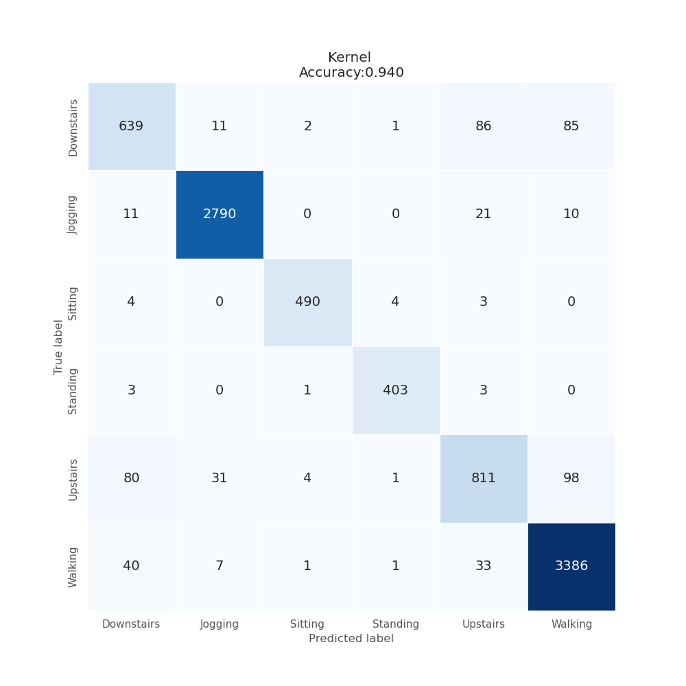

進展があったので報告。  
前編は以下を参照。  

https://qiita.com/NakagawaRen/items/45a8e106faf818f2162d  

結果としてACC：0.9187573356807514からACC:0.94まで大幅にスコアが向上した。  

  

やはり論文に記載されていたようにUp-Downの判別は難しいようだ。  
また、論文に記載こそされていなかったがWalk-Up-Downの区別が難しいのも論文通りである。  

論文：https://www.cis.fordham.edu/wisdm/public_files/sensorKDD-2010.pdf  

翻訳：https://qiita.com/NakagawaRen/items/a4bb582a61e48161b56d  

変更した点は、埋め込み層の実装とEarly Stoppingの再定義である。  

## 埋め込み層の実装

Conv.backboneで計算後にアフィン変換を行うことで任意の次元、チャンネル数でTransformerに入力ができるようになった。  

線形変換ではなくアフィン変換である理由はソースコード解析をした結果、ViTでアフィン変換が行われていたからである。  

## Early Stoppingの再定義
今までのEarly Stoppingには以前のトレーニングセットについて損失よりも悪化している場合には学習の停止を要請していた。  

それを今回は3回連続で学習が悪化していた場合に悪化する前のモデルを最終出力モデルとして採用するように変更した。  

Early Stopping関数を実装したコードが以下。  
```python  
def is_worse(losslist, ref_size, axis="minimize"):  
    if axis == "minimize":  
        return all(x > y for x, y in zip(losslist[-ref_size:], losslist[-ref_size - 1:-1]))  
    elif axis == "maximize":  
        return all(x < y for x, y in zip(losslist[-ref_size:], losslist[-ref_size - 1:-1]))  
    else:  
        raise ValueError("Invalid axis value: " + axis)  
```  

以下のように使用する。  
```python  
    p_models.append(copy.deepcopy(model))  
    if ep > ref_size and is_worse(losslist, ref_size, "minimize"):  
        print(f'early stopping at epoch {ep} with loss {ls:.5f}')  
        model = p_models[0]  
        break  
    if ep > ref_size:  
        del p_models[0] # del oldest model  
```  

従来は20EPOCH程度でEarly Stoppingがかかっていたが、このEarly Stopping方法を採用した結果134EPOCHでEarly Stoppingがかかった。  

以上が変更点である。  

なお、今回の学習にOptunaは用いておらずOptunaを用いることでさらなるスコア向上の可能性もある。  

また、訓練データでの損失関数でEarly Stoppingを判定している。  
そのため、汎化性能が低くなってしまう可能性がある。  
改善案として、訓練データを分割することで検証データを追加し、NCVないしはCVの計算でEarly Stoppingの判定を行うことも考えている。  

今後の課題としては、  

- Optunaを用いたハイパーパラメータの最適化  
- Early Stoppingの改善  
- 学習計画、Warmupの実装  
- データ拡張のトレース  
- コードのリファクタリング  

を考えている。  

現状あまりにもコードの可読性が低く、保守性が低いためOptunaの実装後一旦リファクタリングを行う予定。  
