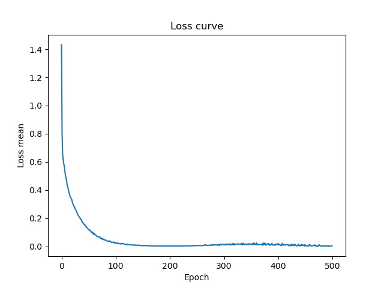

以下のGoogleの提供しているDeep learning tuning bookを実践した。  

https://github.com/google-research/tuning_playbook  

応用、応用、応用と目まぐるしく進歩する深層学習について一度立ち止まって様々な問題に適用できるようにハイパーパラメータのチューニング方法をGoogleがまとめたもの。  
内容が濃く、一度読んだ程度では内容を半分も理解できないと感じた。  

今回吸収できた内容は以下の通り。  

- アーキテクチャについて、はじめは一般的なものを模倣しあとから必要に応じて変更するべし  
- バッチサイズは変更可能なハイパーパラメータに加えるべきではない  
- ハイパーパラメータごとに動かしたらどういった影響があるのかを精査する  
- すべてのハイパーパラメータは「科学的」「迷惑」「固定」の3つに区分される  
- 「科学的」ハイパーパラメータは実験対象、「迷惑」「固定」はその他  
- 探索空間は十分に大きく取る  
- 損失曲線から学習の流れを理解する  
- Optunaは準ランダム探索によって適切な検索空間の探索が完了したあとに用いる  
- 最適化手法から先に最適化を行う  
- 学習率減衰を用いる  


以上の内容から厳選して以下を実装する。  

- バッチサイズを探索区間から排除  
- 学習率減衰を実装後、最適化手法の最適化  
- ハイパーパラメータに対する変化量の確認  
- 損失曲線を可視化  

## バッチサイズを探索区間から排除

チューニングブックによるとバッチサイズはモデルの精度には影響せず、学習効率・訓練時間にのみ影響する。  
そのため、以後バッチサイズを経験的に最良であった128に固定する。  
このバッチサイズの変更による変化量の確認はその他ハイパーパラメータの変化量について実験を多く行うために割愛する。  

## 学習率減衰を実装

以下はコサイン学習律減衰を用いた実装例  

```python  
import torch  


optimizer =  torch.optim.Adam(params, lr=0.001, betas=(0.9, 0.999), eps=1e-08, weight_decay=0)  
scheduler = torch.optim.lr_scheduler.CosineAnnealingLR(optimizer,T_max=, eta_min=0, last_epoch=-1)  

# usage
for epoch in range(MAX_EPOCHS):  
    for x, t in train_loader:  
        optimizer.zero_grad()  
        y = model(input)  
        loss = loss_function(output, t)  
        loss.backward()  
        optimizer.step()  
    scheduler.step()  
```  
T_max: min_lrになるまでのエポック数  

## ハイパーパラメータに対する変化量の確認
今回のモデルに対するハイパーパラメータは以下。  
正則化のためのハイパーパラメータは省略する。  

### Optimizer
- lr:　1e-6, 1e-5が重点的に探索されており、1e-5がACCが高い傾向にあった  
- betas:　1D-ViTでは(0.99, 0.99)が、Conv.Tでは(0.9,0.999)が重点的に探索されていた  
- eps:　1e-9, 1e-8が重点的に探索されており、1e-8がACCが高い傾向にあった  

### 1d vision transformer Scheduler
- T_max: 50が重点的に探索されており、T_max=MAX_EPOCHではACCは低い結果となった  
- eta_min:0が重点的に探索されており、ACCの最大値には差異はみられなかった  

### 1d vision transformer
- patch_size: 8が重点的に探索されており、ACCも高い結果となった  
- dim: 256が重点的に探索されており、ACCも高い結果となった  
- depth: 6, 9が重点的に探索されており、ACCは6が高い傾向にあった  
- heads: 10, 16が重点的に探索されており、ACCは10が高い傾向にあった  
- mlp_dim: 2048が重点的に探索されており、ACCも高い結果となった  
- dropout: 0.2が重点的に探索されており、ACCも高い結果となった  
- emb_dropout: 0.4が重点的に探索されており、ACCも高い結果となった  

### conv.backbone transformer Scheduler
- T_max: 50と150が重点的に探索されており、ACCは50が高い傾向にあった  
- eta_min: 1e-6と1e-5が重点的に探索されており、ACCは1e-6が高い傾向にあった  

### conv.backbone transformer
- hidden_dim:128, 1024が重点的に探索されており、ACCは1024が高い傾向にあった  
- hidden_ch: 8が重点的に探索されており、ACCも高い結果となった  
- depth: 3, 8が重点的に探索されており、ACCは3が高い傾向にあった  
- heads: 5, 6が重点的に探索されており、ACCは6が高い傾向にあった  
- mlp_dim: 256が重点的に探索されており、ACCも高い結果となった  
- dropout: 0.01, 0.1, 0.5が重点的に探索されており、ACCは0.001が高い傾向にあった  
- emb_dropout: 0.01, 0.1が重点的に探索されており、ACCは0.001が高い傾向にあった  

### パイパーパラメータ探索表
|| 重点探索箇所                   | ACCが高い箇所|  
|--------------------------------|---|-----------------------------|  
|||  
| ## Optimizer                   |      |  
| lr                             | 1e-6, 1e-5|1e-5 |  
| betas                          | 1D-ViT:(0.99, 0.99) Conv.T:(0.9, 0.999)||  
| eps                            | 1e-9, 1e-8|1e-8|  
|||  
| ## 1d vision transformer Scheduler |  |  
| T_max                          | |50|  
| eta_min                        | 0|差異はみられなかった     |  
|||  
| ## 1d vision transformer      | |  
| patch_size                     | |8|  
| dim                            | |256|  
| depth                          | 6, 9|6|  
| heads                          | 10, 16|10      |  
| mlp_dim                        || 2048             |  
| dropout                        || 0.2            |  
| emb_dropout                    || 0.4             |  
|||  
| ## conv.backbone transformer Scheduler |                                                        |  
| T_max                          | 50, 150|50       |  
| eta_min                        | 1e-6, 1e-5|1e-6 |  
|||  
| ## conv.backbone transformer  |          |  
| hidden_dim                     | 128, 1024|1024  |  
| hidden_ch                      | |8              |  
| depth                          | 3, 8|3      |  
| heads                          | 5, 6|6          |  
| mlp_dim                        | |256|  
| dropout                        | 0.01, 0.1, 0.5|0.001|  
| emb_dropout                    | 0.01, 0.1|0.001|  


## 損失曲線を可視化
```python  
import matplotlib.pyplot as plt  


losslist = list()  

#-- learning process --

plt.plot(losslist)  
plt.xlabel('Epochs')  
plt.ylabel('Loss mean')  
plt.title('Loss curve')  
plt.savefig(path)  
```  

1D-Vision Transformer(not scheduling)  
  

1D-Vision Transformer(cosine scheduling)  
  

Conv.backbone Transformer(not scheduling)  
  

Conv.backbone Transformer(cosine scheduling)  
  


それぞれの損失曲線を比較する。  
なお、Early Stoppingの条件は5回連続で精度が悪化した場合とした。  
（他の条件例としてbest_socreとmodelを保存する方法も検討中）  

1D-Vision Transformer(not scheduling)では学習が早く進みランダムウォークをしながらEPOCH=87でEarly Stoppingがかかっている。  
Conv.backbone Transformer(not scheduling)では、学習が1D-Vision Transformerと比べるとゆっくりと進み、MAX_EPOCHの500回まで学習が進んだ。  
しかし、精度はEPOCH=200の場合と変化がなかった為、ただ過学習しなかっただけだと考える。  

また、Cosine Schedulingを採用した場合には両方のモデルにおいて学習に滑らかさが生まれEPOCH数も上昇している。  
精度も向上したことから学習率減衰は学習を促進し、正の方向に作用した。  


# 結論

今回はGoogleの提供しているチューニングブックを実践した。  

この体験を通して、感覚的に行っていたことが言語化され無駄の少ない実験ができるようになったことが実感できた。  

また、チューニングブックを部分的ではあるが実践したことにより、ローカル環境で1D-CNNのスコアを超えることができた為、自分のスキルアップを定量的に感じられた。  
