# 前処理による精度の変化
## 前処理の種類
- 絶対値：時間ごとに絶対値を計算  
- ローパスフィルタ：高速フーリエ変換を用い高周波部分をカットし逆フーリエ変換  
- ガウシアンフィルタ：ガウスカーネルでフィルタリング  
- メディアンフィルタ：メディアンカーネルでフィルタリング  
- 差分：前の値との差分を計算  
- 時間積分：以前の値の和をとり、サンプリングレートで除算  

## 前処理の可視化
サンプルとして歩くラベルのデータについて前処理を行ったものを示す。  
それぞれ折りたたんでいるので、確認したい項目を適宜クリックして頂きたい。  

  
元データ  

  

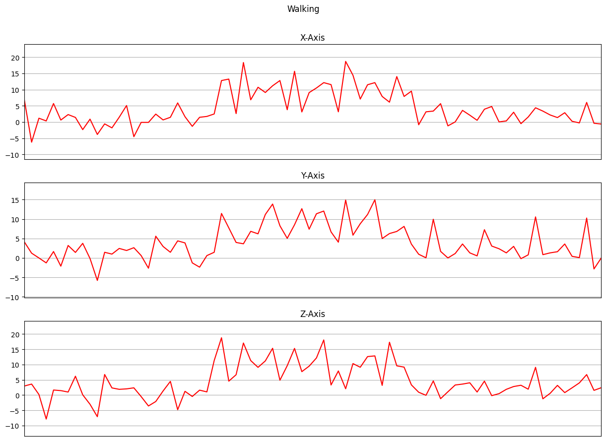  

  

  
絶対値  

  

  

  

  
一階差分  

  

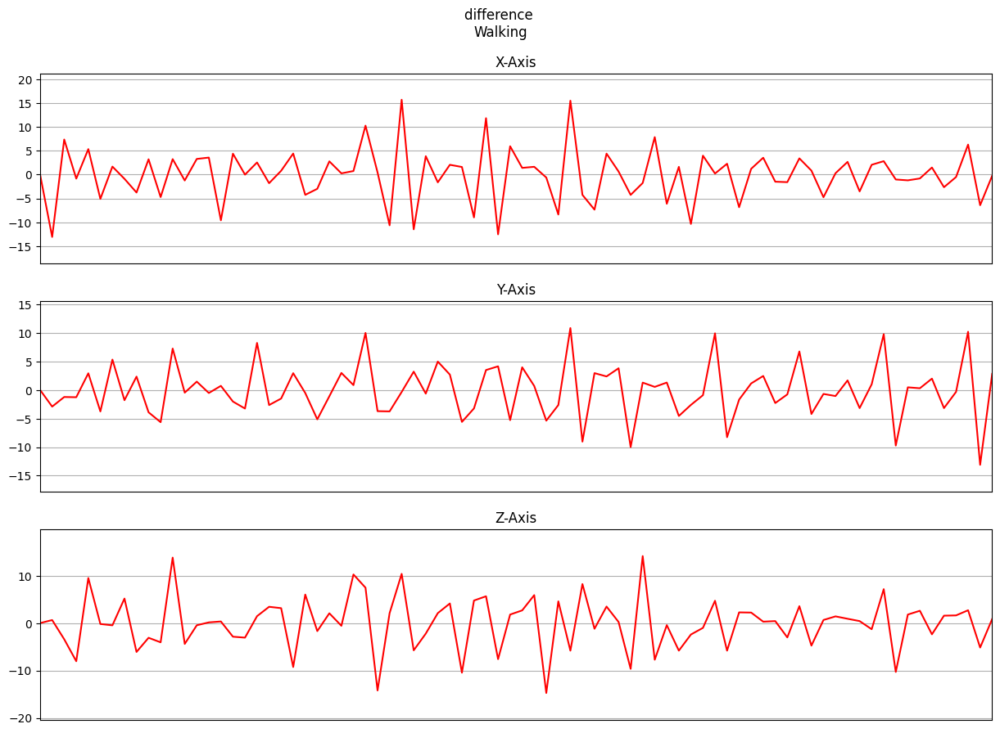  

  

  
二階差分  

  

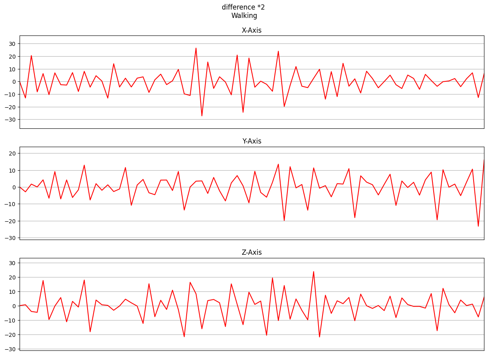  

  

  
ローパスフィルタ  

  

サンプリングレートの2倍以上の高周波はカットしている。  
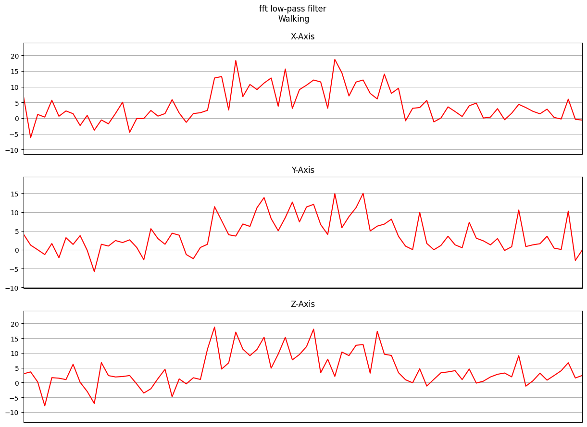  

  

  
ガウシアンフィルタ  

  

カーネルサイズは3、分散は1に設定した。  
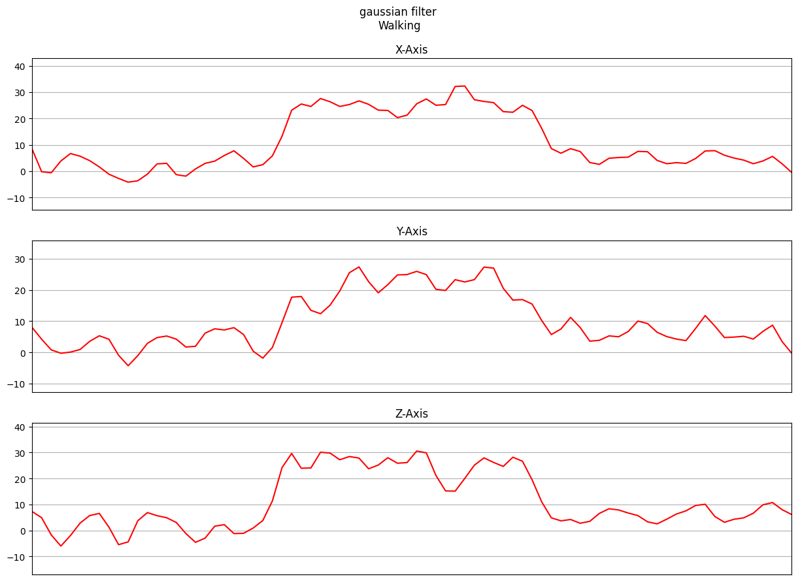  

  

  
メディアンフィルタ  

  

カーネルサイズは3に設定した。  
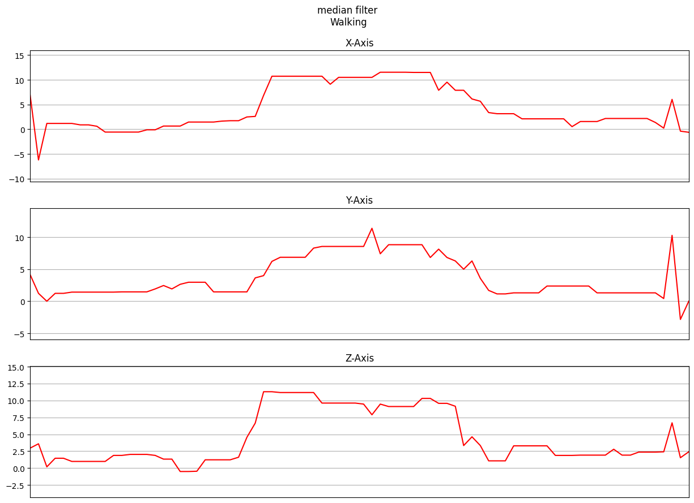  

  

  
ローパスフィルタ、一階差分  

  

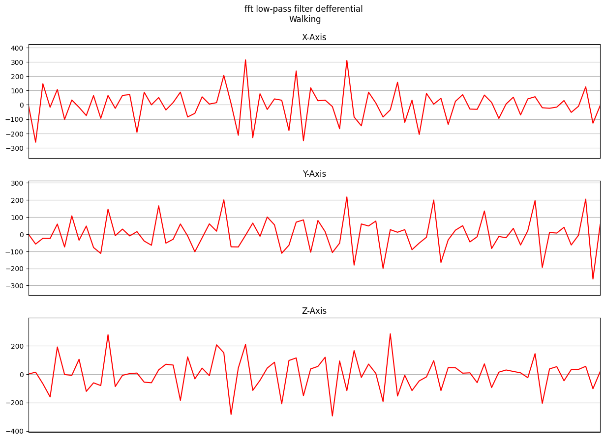  

  

  
ガウシアンフィルタ、一階差分  

  

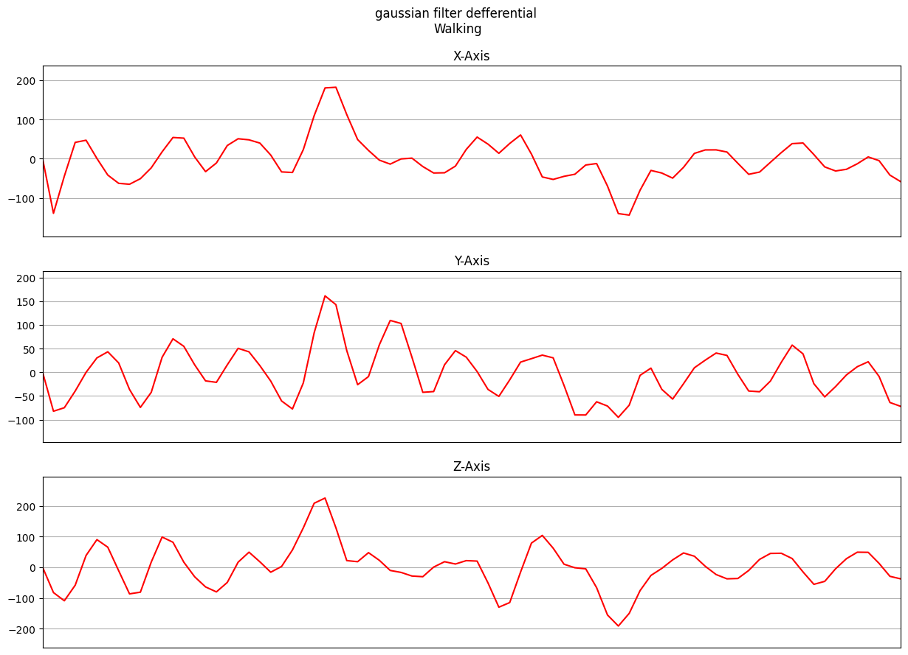  

  

  
メディアンフィルタ、一階差分  

  

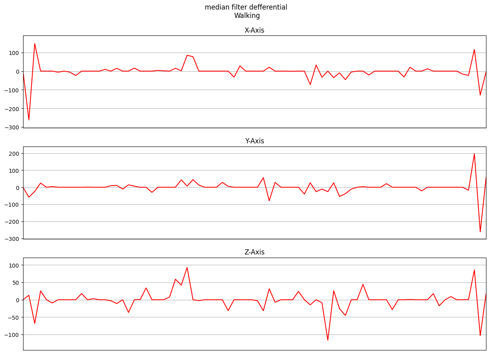  

  

  
ローパスフィルタ、二階差分  

  

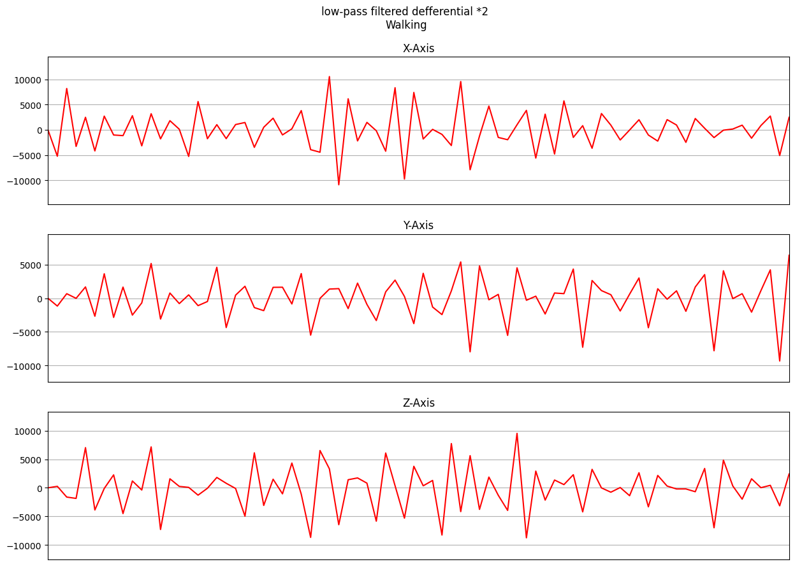  

  

  
ガウシアンフィルタ、二階差分  

  

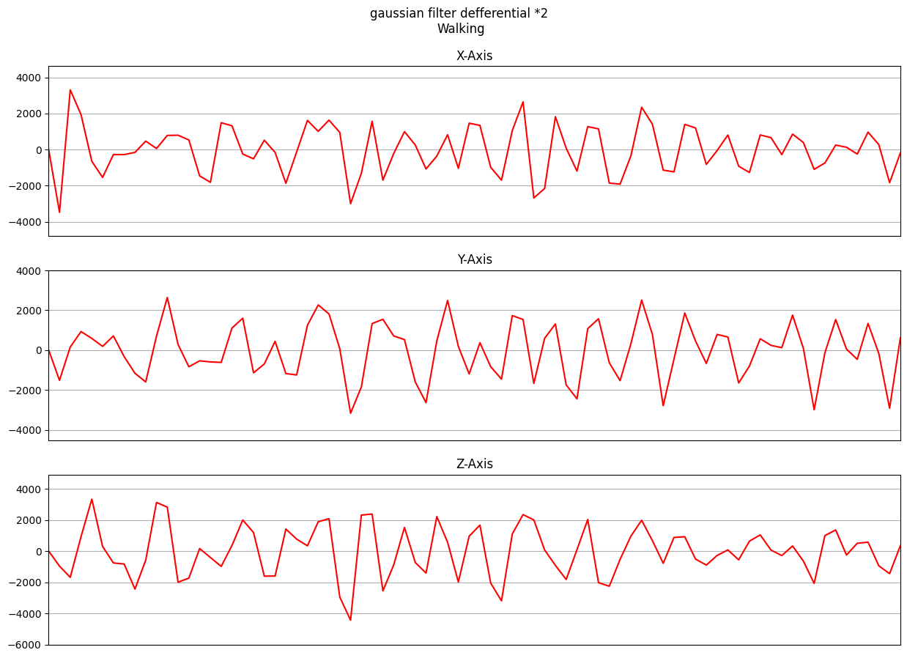  

  

  
メディアンフィルタ、二階差分  

  

  

  

  
一階時間積分  

  

一階時間積分を行うことで次元としては速度の次元となる。  
また、物理的な意味合いとして初速度が同じ等加速度運動との速度差を表す。  
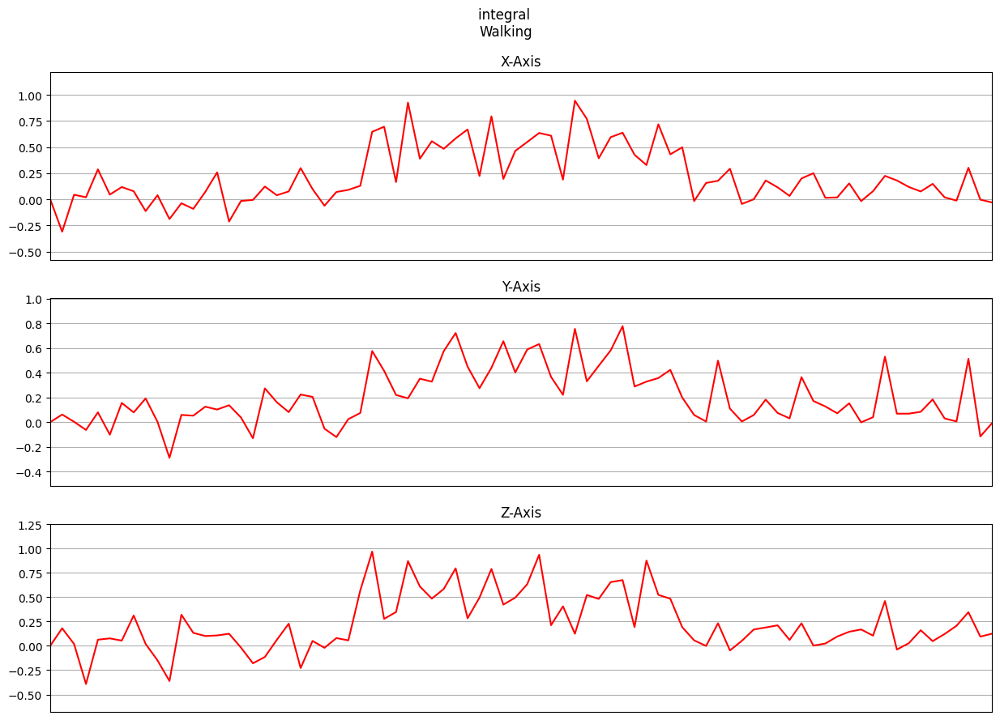  

  

  
二階時間積分  

  

二階時間積分を行うことで次元としては位置の次元となる。  
また、物理的な意味合いとして初速度が同じ等加速度運動との位置差を表す。  
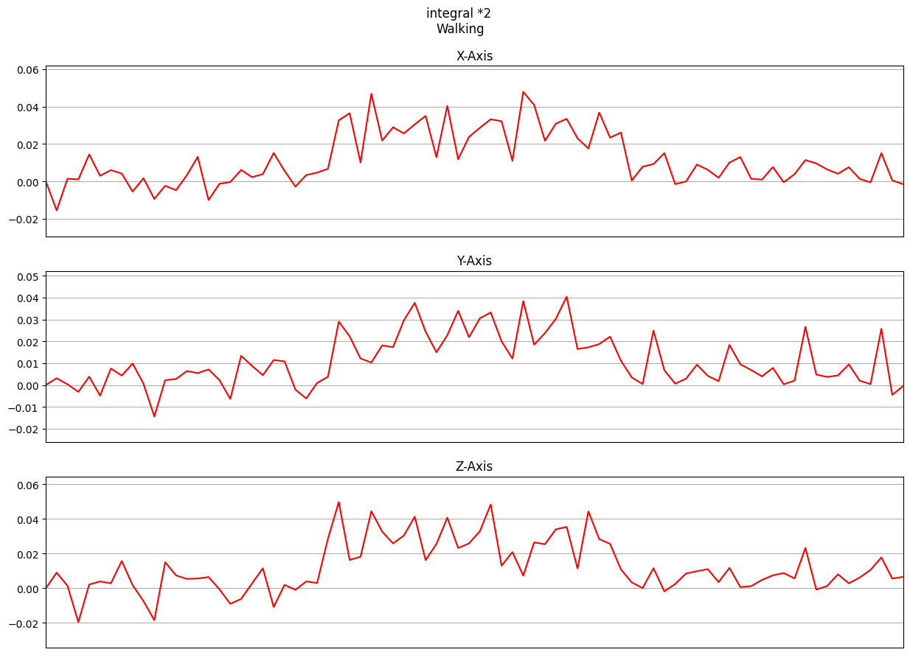  

  

# 前加工したものを加えて入力

以上の処理を行い、次元を揃えるために正規化を行ってから入力した。  

結果は、  
- 時間ごとに入力し72通りのハイパーパラメータ探索を行ったが、ACCは66.77%  
- 軸ごとに入力し、72通りのハイパーパラメータ探索を行ったが、最良のACCは68.13%  

結果は、無処理と比べて大きく精度が悪化した。  
原因を探るために前処理それぞれ単体で入力を行い、ボトルネックが存在しないかを確認する。  

## 入力方法による精度まとめ
アーキテクチャとして以下の通りを試した。  
前処理と同様折りたたんでいるため表示したいアーキテクチャ名をクリックして頂きたい。  

  
Vanilla Transformer  

  

| インデックス | フィルタ処理 | 処理     | 入力軸 | 精度(埋め込み-正規化なし) | 精度(埋め込み-正規化あり)  
|-------|------------|---------|-------|-------|-------|  
| 1     | なし       | なし    | 軸     | 92.7%  | 92.5%  |  
| 2     | なし       | 1回差分 | 軸     | 93.0%  | 92.8%  |  
| 3     | なし       | 2回差分 | 軸     | 93.0%  | 92.7%  |  
| 4     | メディアン | なし    | 軸     | 88.1%  | 87.8%  |  
| 5     | メディアン | 1回差分 | 軸     | 88.6%  | 88.2%  |  
| 6     | メディアン | 2回差分 | 軸     | 88.5%  | 88.1%  |  
| 7     | ガウシアン | なし    | 軸     | 89.8%  | 90.0%  |  
| 8     | ガウシアン | 1回差分 | 軸     | 91.5%  | 89.8%  |  
| 9     | ガウシアン | 2回差分 | 軸     | 91.6%  | 89.7%  |  
| 10     | なし       | 1回積分 | 軸     | 92.5%  | 92.6%  |  
| 11     | なし       | 2回積分 | 軸     | 92.3%  | 92.8%  |  
|       |           |         |       |      |      |  
| 12    | なし       | なし    | 時間   | 74.1%  | 75.9%  |  
| 13    | なし       | 1回差分 | 時間   | 75.0%  | 75.3%  |  
| 14    | なし       | 2回差分 | 時間    | 75.2%  | 76.4%  |  
| 15    | メディアン | なし    | 時間   | 67.3%  | 68.8%  |  
| 16    | メディアン | 1回差分 | 時間   | 65.8%  | 70.2%  |  
| 17    | メディアン | 2回差分 | 時間   | 65.8%  | 67.3%  |  
| 18    | ガウシアン | なし    | 時間   | 58.6%  | 59.1%  |  
| 19    | ガウシアン | 1回差分 | 時間   | 55.8%  | 63.3%  |  
| 20    | ガウシアン | 2回差分 | 時間   | 59.5%  | 60.4%  |  
| 21    | なし       | 1回積分 | 時間   | 74.8%  | 75.9%  |  
| 22    | なし       | 2回積分 | 時間   | 71.6%  | 73.1%  |  

  

  
Conv.BackBone Transformer  

  

| インデックス | フィルタ処理 | 処理     | 入力軸 | 精度(埋め込み-正規化なし) | 精度(埋め込み-正規化あり) | 精度(三角波-正規化なし) | 精度(三角波-正規化あり) |  
|-------|------------|---------|-------|-------|-------|-------|-------|  
| 1     | なし       | なし    | 軸     | 95.7%  | 94.1%  | 93.7% | 93.9% |  
| 2     | なし       | 1回差分 | 軸     | 94.6%  | 94.5%  | 92.9% | 92.2% |  
| 3     | なし       | 2回差分 | 軸     | 96.4%  | 93.2%  | 93.9% | 94.2% |  
| 4     | メディアン | なし    | 軸     | 91.5%  | 90.1%  | 90.1% | 91.2% |  
| 5     | メディアン | 1回差分 | 軸     | 91.0%  | 89.2%  | 90.6% | 88.3% |  
| 6     | メディアン | 2回差分 | 軸     | 90.8%  | 90.1%  | 90.3% | 90.0% |  
| 7     | ガウシアン | なし    | 軸     | 92.0%  | 85.4%  | 91.3% | 90.7% |  
| 8     | ガウシアン | 1回差分 | 軸     | 90.7%  | 87.5%  | 92.5% | 87.6% |  
| 9     | ガウシアン | 2回差分 | 軸     | 91.6%  | 88.9%  | 92.3% | 88.5% |  
| 10     | なし       | 1回積分 | 軸     | 5.6%  | 93.4%  | 93.9% | 93.0% |  
| 11     | なし       | 2回積分 | 軸     | 95.7%  | 94.0%  | 11.1% | 93.2% |  
|       |           |         |       |      |      |      |      |  
| 12    | なし       | なし    | 時間   | 90.9%  | 90.0%  | 90.7% | 90.5% |  
| 13    | なし       | 1回差分 | 時間   | 89.9%  | 90.8%  | 90.7% | 90.5% |  
| 14    | なし       | 2回差分 | 時間    | 90.2%  | 89.7%  | 90.7% | 90.3% |  
| 15    | メディアン | なし    | 時間   | 86.3%  | 86.5%  | 84.5% | 87.5% |  
| 16    | メディアン | 1回差分 | 時間   | 86.1%  | 87.2%  | 85.7% | 86.9% |  
| 17    | メディアン | 2回差分 | 時間   | 86.3%  | 85.9%  | 85.6% | 86.6% |  
| 18    | ガウシアン | なし    | 時間   | 86.0%  | 87.5%  | 85.1% | 86.2% |  
| 19    | ガウシアン | 1回差分 | 時間   | 82.9%  | 87.6%  | 85.2% | 86.5% |  
| 20    | ガウシアン | 2回差分 | 時間   | 84.6%  | 86.9%  | 86.4% | 85.5% |  
| 21    | なし       | 1回積分 | 時間   | 90.6%  | 90.3%  | 90.0% | 91.3% |  
| 22    | なし       | 2回積分 | 時間   | 90.2%  | 90.1%  | 90.2% | 90.2% |  

  

## 考察
### それぞれの前処理入力について
最も精度が良かったのは、「軸ごとの入力で2回差分を正規化をせずに入力したもの」であった。  
ただし分散が大きいモデルである（シードによるゆらぎが大きい）ことには注意が必要である。  

前処理の効果: 正規化なしの場合、前処理に関係なく、精度に大きな違いは見られない。正規化ありの場合、前処理によって精度に差が現れている。正規化が精度向上に寄与している。しかしあまり大きな変化が見られないのはConv. BackBoneと線形変換がクッションの役割を果たしているのではないかと考える。  

フィルタ処理の効果: フィルタ処理によって、精度に大きな違いが見られる。特にガウシアンフィルタ処理を使用すると、正規化なしの場合に精度が低下する傾向がある。一方、正規化ありの場合、フィルタ処理が精度向上に寄与している。ガウシアンフィルタが最も人間的には特徴を抽出できているように感じたが機械学習に入力する場合には人間目にはノイズに感じるような情報も必要ということがわかった。  

処理の種類の効果: 処理の種類によっても精度に違いがある。特に、1回差分や2回差分の処理は、精度に影響を与えることがある。正規化なしの場合、2回差分の処理が精度を向上させることが多い一方、正規化ありの場合、1回差分の処理が精度向上に寄与している。  

入力軸の効果: 入力軸（軸と時間）によっても精度に差が見られる。軸の方が時間よりも一般的に高い精度を示している。  

精度の変化: 正規化なしと正規化ありの比較において、正規化を行った場合、一部の処理で精度が向上し、他の処理で精度が低下することがある。そのため、正規化の適切な選択が重要である。  

それぞれ入力した場合には精度は90%程度得られていることからなにか単一の処理方法が精度の低下をもたらしているのではなく、モダリティの違いをConvBackBoneでは処理できなかったのではないかと考える。  

データの差分や相互関係について、前処理で与えることを考えていたがtransformerアーキテクチャを用いるのであれば、MHAによって差分の計算は可能であるため前処理を恣意的に加える必然性はないと考える。  

また、入力形式についてMSAではベクトル列について線形変換を施す為原理的に入力形式に依存しない。  
一方でCLSトークンが3次元となってしまう為、データの取捨選択が激しい。  
よって今回のデータセットの場合には軸ごとの入力が有効に働いたのではないかと考える。  

### モデルアーキテクチャについて
ViTで精度が悪かったのは、ViTでは時間区切りが大切なECGで用いられているように加重平均を取るような操作をしており、軸区切りでの推移が重要であった為ではないだろうか。  
今回の問題は軸ごとに入力するほうが精度が全体として高い為、ViTでは精度が悪かったと考えられる。  

PEを用いるモチベーションについて調べた所、絶対的な位置関係が重要な場合と長系列データの処理を行う場合に有効だと記載されていた。  
また、Transformerアーキテクチャは文章中の長期依存関係を考慮することが目的のモデルである。  
以上の理由から、今回の実験でも時間ごとに入力が有効に思えるが、有効性はみられなかった。  

### アーキテクチャの改善
現在のd_model次元を80→1024に線形変換を行う部分について、一枚の重み行列では一種類の変換（微分の役割をもつ行列等）しか行えないではないかという指摘を受けた。  
また、これについて畳み込みNNを用いることで点単位畳み込み層と線形変換を合わせた効果が得られるのではないかという改善案を受け実験を行った。  

結果として、精度の最大値は94.9%と最良スコアの更新はしなかった。  
しかし、2層の畳み込み層（18-20, 3ストライド）で4層の点単位畳み込み層、埋め込み層、位置埋め込みを代替したとも考えられるので軽量化、無駄を削ぐという意味では良い結果に思える。  
