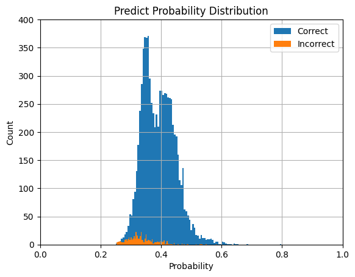
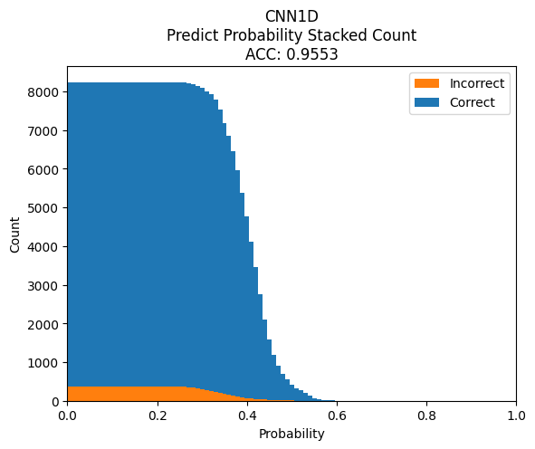
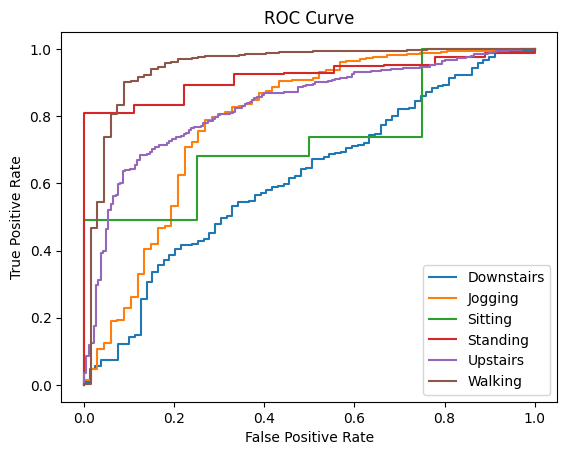
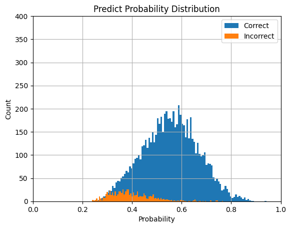
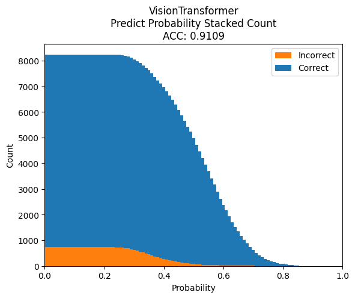
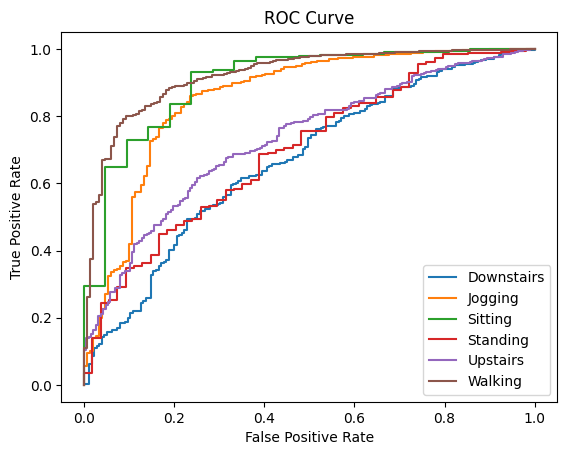
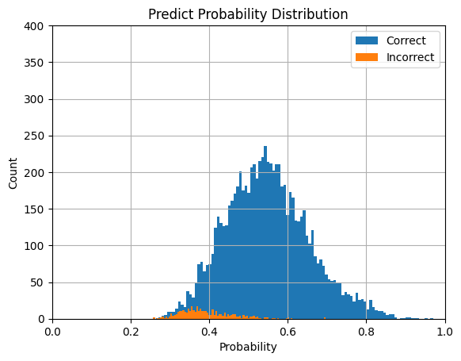
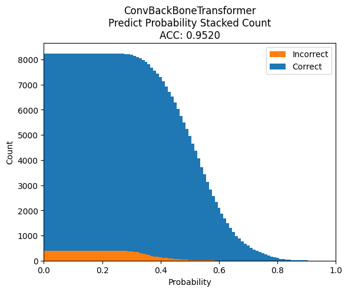
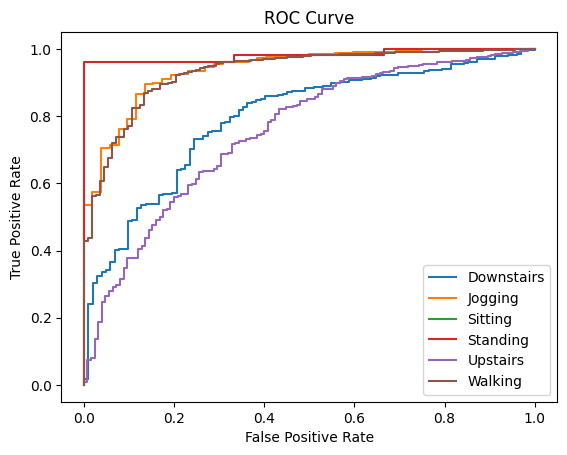
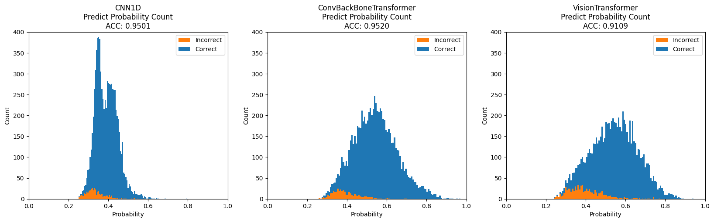

# 予測の確度

各モデルの予測の確度を可視化し、閾値に応じて精度を検証した。  

## 1DCNN

予測の確度の分布は以下のようになる。  

### 各確度ごと
  

### 累積確度
#### 全ラベル
  

#### 各ラベル
  

### 統計量
| Statistic | Minimum | Maximum |  Mean  | Median |   Std   |  
|-----------|---------|---------|--------|--------|---------|  
|   Value   |  0.25   |  0.72   |  0.42  |  0.42  |  0.05   |  

### 閾値ごとの精度
| threshold | confidence_accuracy | confidence_ratio | drop_accuracy | drop_ratio |  
|------|----------|----------|----------|----------|  
| 0.00 | 0.955324 | 1.000000 | 0.000000 | 0.000000 |  
| 0.30 | 0.960599 | 0.989074 | 0.477778 | 0.010926 |  
| 0.35 | 0.973807 | 0.913075 | 0.761173 | 0.086925 |  
| 0.40 | 0.982358 | 0.653757 | 0.904278 | 0.346243 |  
| 0.50 | 0.987478 | 0.067865 | 0.952983 | 0.932135 |  

## Vision Transformer

### 各確度
  

### 累積確度
#### 全ラベル
  

#### 各ラベル
  

### 統計量
| Statistic | Minimum | Maximum |  Mean  | Median |   Std   |  
|-----------|---------|---------|--------|--------|---------|  
|   Value   |  0.24   |  0.94   |  0.54  |  0.54  |  0.12   |  

### 閾値ごとの精度
| threshold | confidence_accuracy | confidence_ratio | drop_accuracy | drop_ratio |  
|-----|----------|----------|----------|----------|  
| 0.0 | 0.910890 | 1.000000 | 0.000000 | 0.000000 |  
| 0.3 | 0.918989 | 0.984582 | 0.393701 | 0.015418 |  
| 0.4 | 0.956485 | 0.862086 | 0.625880 | 0.137914 |  
| 0.5 | 0.983193 | 0.635668 | 0.784738 | 0.364332 |  
| 0.6 | 0.990076 | 0.318077 | 0.873954 | 0.681923 |  
| 0.7 | 0.990489 | 0.089353 | 0.903080 | 0.910647 |  

## ConvBackBone Transformer

### 各確度
  

### 累積確度
#### 全ラベル
  

#### 各ラベル
  

### 統計量
| Statistic | Minimum | Maximum |  Mean  | Median |   Std   |  
|-----------|---------|---------|--------|--------|---------|  
|   Value   |  0.26   |  0.97   |  0.54  |  0.54  |  0.11   |  

### 閾値ごとの精度
| threshold | confidence_accuracy | confidence_ratio | drop_accuracy | drop_ratio |  
|-----|----------|----------|----------|----------|  
| 0.0 | 0.952046 | 1.000000 | 0.000000 | 0.000000 |  
| 0.3 | 0.953897 | 0.995387 | 0.552632 | 0.004613 |  
| 0.4 | 0.979669 | 0.901663 | 0.698765 | 0.098337 |  
| 0.5 | 0.993693 | 0.635183 | 0.879534 | 0.364817 |  
| 0.6 | 0.997849 | 0.282263 | 0.934032 | 0.717737 |  
| 0.7 | 1.000000 | 0.081826 | 0.947772 | 0.918174 |  

## 比較
### 各確度
  

### 統計量

| Statistic | Minimum | Maximum |  Mean  | Median |   Std   |  
|-----------|---------|---------|--------|--------|---------|  
|   1dcnn   |  0.25   |  0.72   |  0.42  |  0.42  |  0.05   |  
|    vit    |  0.24   |  0.94   |  0.54  |  0.54  |  0.12   |  
|  convbbt  |  0.26   |  0.97   |  0.54  |  0.54  |  0.11   |  

## 考察
1DCNNについて、確度と精度に相関は見受けられない。  
VisionTransformerについて、確度と精度に一定の相関が見受けられる。  
Conv.BackBoneTransformerについて、元の状態（閾値が0）との比較をすると確度と正答率には相関が見受けられる。さらに閾値を0.4にすると明確に精度が向上し、0.5で頭打ちになっている。テストデータのサンプル数が8237なので閾値を0.4にすると800個程度(1％)、0.5にすると3000個程度(36％)確度の低い予測が除かれている。  

1DCNNとTransformerアーキテクチャを比較して、そもそもTransformerアーキテクチャでは最終出力にSoftmax関数を用いていない。これはTransformerアーキテクチャでは深い関数となっているのでSoftmax関数を用いて値を確率化してしまうと誤差が小さくなり、逆伝播する値が小さくなってしまうと考えたからである。一方で1DCNNではSoftmax関数を用いている。これは4層の浅いネットワークであるから問題はない、むしろSoftmax関数を用いない場合正答率が70％程度にまで低下してしまうためSoftmax関数を用いなければならない。  
その上で精度を比較したところ、確度の大きい予測に対してはTransformerのほうが精度が高い。  

誤差の分布について正規分布に従っているように見える。  
これについての明確な説明はできないが、仮説として交差エントロピー誤差が予測確率分布を訓練データの確率分布と比較し、誤差を計算していることに起因していると考える。  

また、1DCNNは非常に急な分布になっていることに関して出力結果を確認すると、他モデルと比べマイナスの値が非常に大きかったことが原因であった。  
しかし、Transformerモデルの出力にSoftmax関数を適用することは誤差消失を生んでしまったことから難しく、逆の場合では誤差が発散してしまった為、この問題は根深い。  
