# アンサンブル
# アンサンブル-MODEL-
## 使用するモデル
- 1D-CNN  
- Vision Transformer  
- Conv.BackBone Transformer  

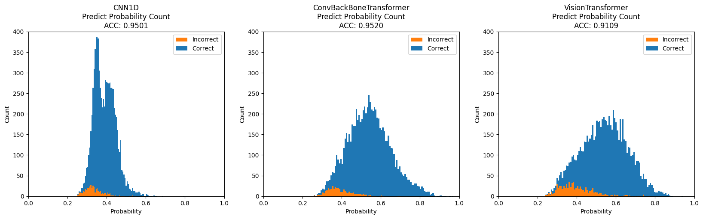  

## それぞれのモデルの出力データの解析
テストデータの数は8237個  
内、  
すべてのモデルが正解していたデータは7193個  
すべてのモデルが不正解であったデータは86個  
そのため、理想的な精度は98.96%となる。  
すべてのモデルが不正解であったデータのラベルの内訳は以下の通り。  

| Activity   | Upstairs | Downstairs | Walking | Jogging | Sitting | Standing |  
|-------|----|----|----|----|---|---|  
| Count | 37 | 15 | 13 | 12 | 6 | 3 |  

モデルそれぞれの確度をインデックスごとにプロットした。  
確度の大きいものが三色均一にあれば、最高確度を取るアンサンブルが効くと言える。  
しかし、今回は1DCNNに対応する青が極端に少なく、最高確度を取るアンサンブルに寄与できないことがわかる。  
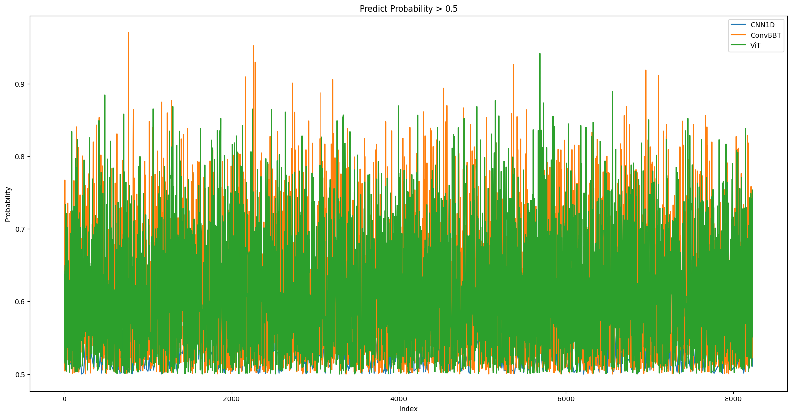  

## 方法1.確率分布の平均をとる
### 精度
  

### 各確度
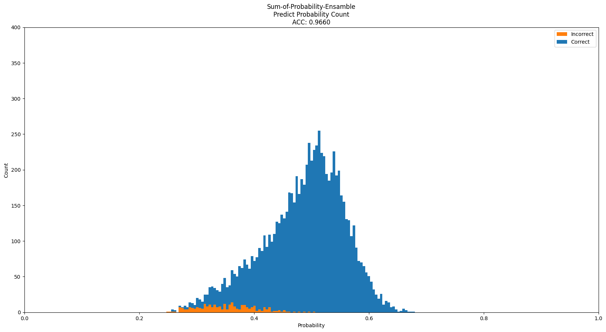  

### 累積確度
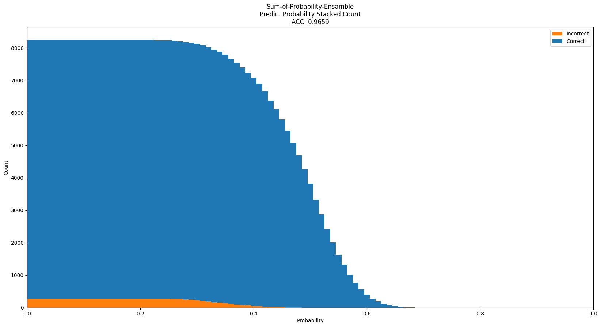  

| threshold | accuracy  | count |  
|-----------|-----------|-------|  
| 0.0       | 0.965886  | 8237  |  
| 0.1       | 0.965886  | 8237  |  
| 0.2       | 0.965886  | 8237  |  
| 0.3       | 0.970102  | 8161  |  
| 0.4       | 0.990747  | 7241  |  
| 0.5       | 0.999766  | 4267  |  
| 0.6       | 1.000000  | 558   |  

## 方法2.多数決をとる
### 精度
  

### 各確度
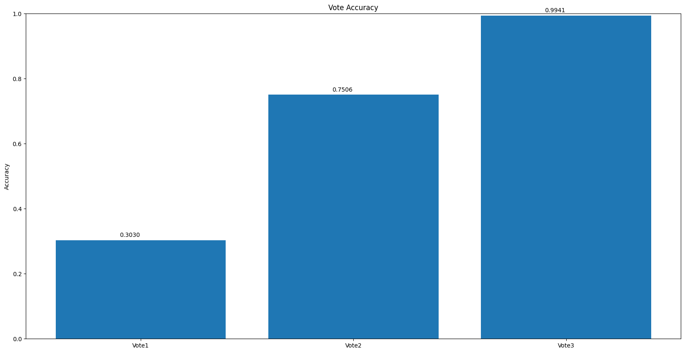  

### 累積確度
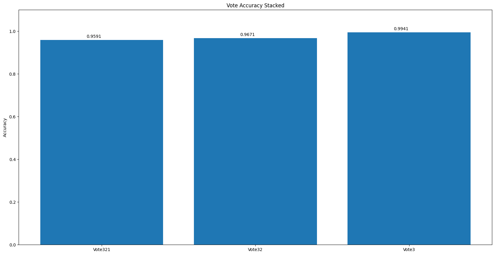  

### 多数決票の内訳
| Vote num | Number |  
|--------- |------- |  
| 3 Vote   | 7236   |  
| 2 Vote   | 902    |  
| 1 Vote   | 99     |  
|          |        |  
| Total    | 8237   |  

## 方法3.最も確度の高いものを採用する
### 精度
  

### 各確度
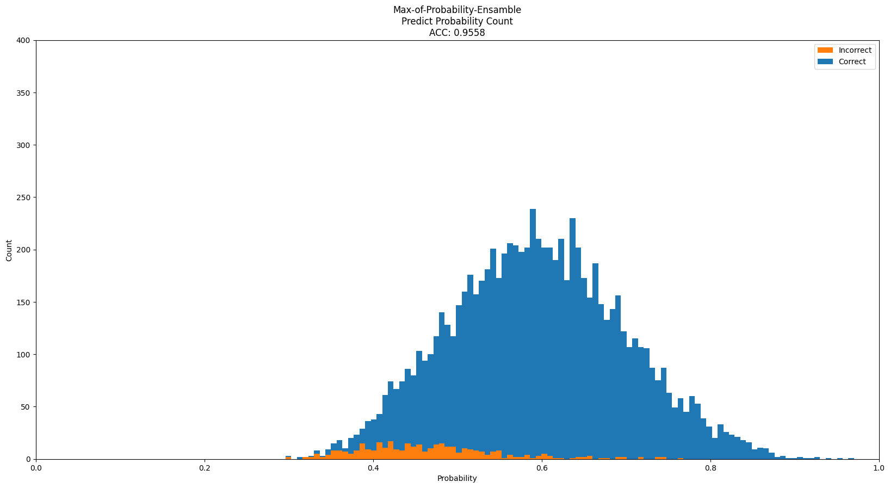  

### 累積確度
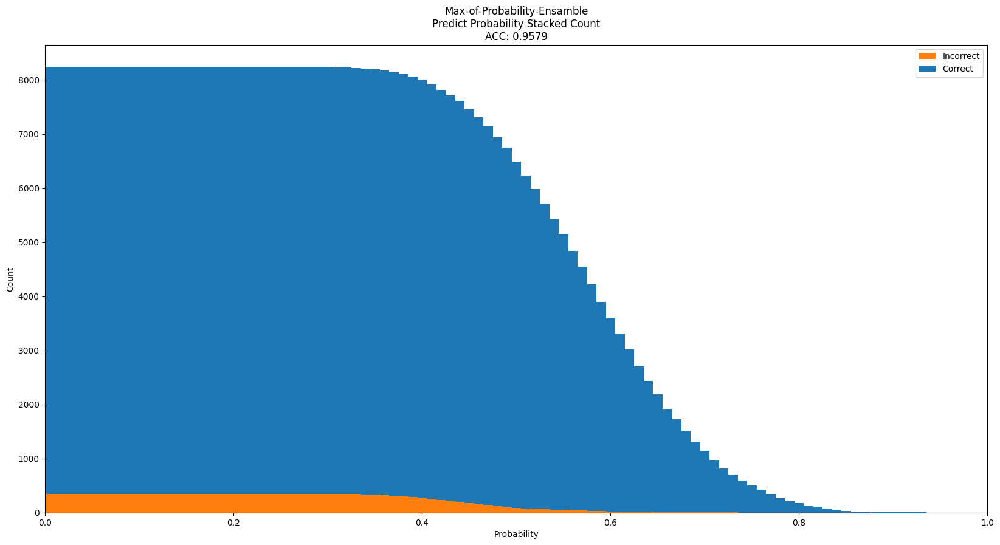  

| threshold | accuracy  | count |  
|-----------|-----------|-------|  
| 0.0       | 0.957873  | 8237  |  
| 0.1       | 0.957873  | 8237  |  
| 0.2       | 0.957873  | 8237  |  
| 0.3       | 0.957989  | 8236  |  
| 0.4       | 0.964649  | 8062  |  
| 0.5       | 0.984129  | 6742  |  
| 0.6       | 0.992286  | 3889  |  
| 0.7       | 0.994644  | 1307  |  
| 0.8       | 1.000000  | 219   |  

# アンサンブル-ConvBBTLayers-

## 使用するモデル
すべてConv.BackBone Transformerアーキテクチャを使用した。  
そのなかでTransformerブロックの数を変更したモデルを3種類用意しアンサンブルを行う。  
- 3Layer TransfomerBLock  
- 5Layer TransfomerBLock  
- 7Layer TransfomerBLock  

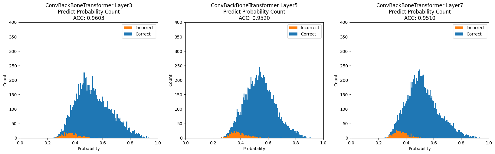  

## それぞれのモデルの出力データの解析
テストデータの数は8237個  
内、  
すべてのモデルが正解していたデータは7452個  
すべてのモデルが不正解であったデータは129個  
そのため、理想的な精度は98.43%となる。  
すべてのモデルが不正解であったデータのラベルの内訳は以下の通り。  

| Activity   | Upstairs | Downstairs | Walking | Jogging | Sitting | Standing |  
|-------|----|----|----|----|---|---|  
| Count | 50 | 36 | 17 | 16 | 6 | 4 |  

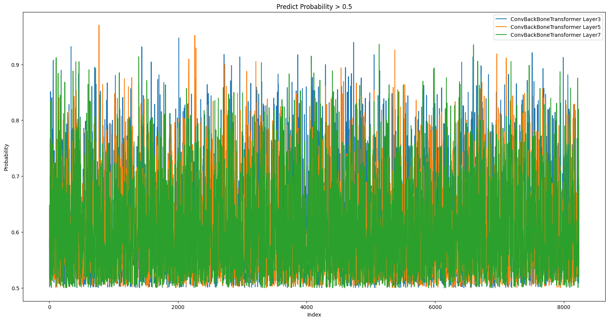  

## 方法1.確率分布の平均をとる
### 精度
  

### 各確度
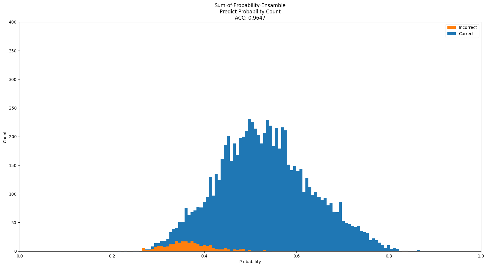  

### 累積確度
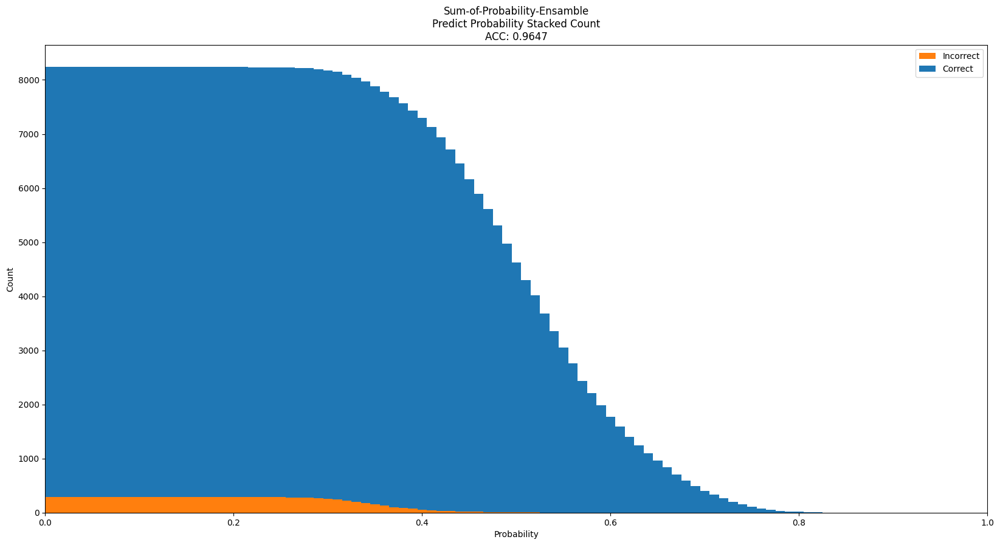  

| threshold | accuracy  | count |  
|-----------|-----------|-------|  
| 0.0       | 0.964672  | 8237  |  
| 0.1       | 0.964672  | 8237  |  
| 0.2       | 0.964672  | 8237  |  
| 0.3       | 0.967785  | 8195  |  
| 0.4       | 0.990588  | 7437  |  
| 0.5       | 0.998592  | 4971  |  
| 0.6       | 1.000000  | 1982  |  

## 方法2.多数決をとる
### 精度
  

### 各確度
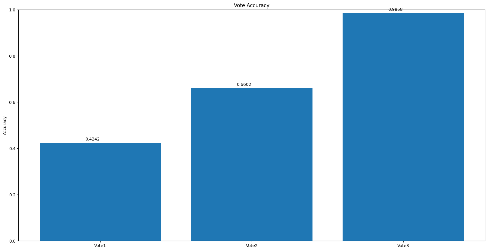  

### 累積確度
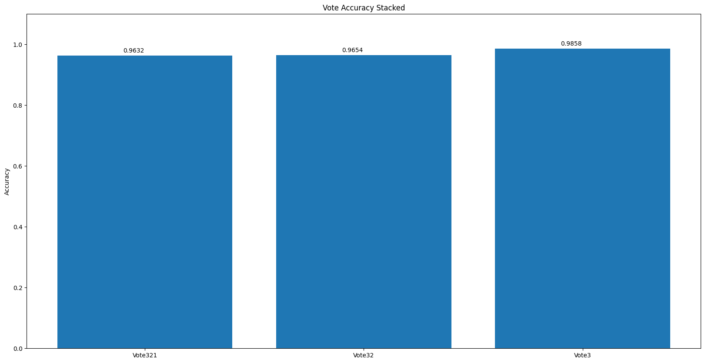  

### 多数決票の内訳
| Description  | Number |  
|------------- |------- |  
| Vote 3 num   | 7689   |  
| Vote 2 num   | 515    |  
| Vote 1 num   | 33     |  
| Total        | 8237   |  

## 方法3.最も確度の高いものを採用する
### 精度
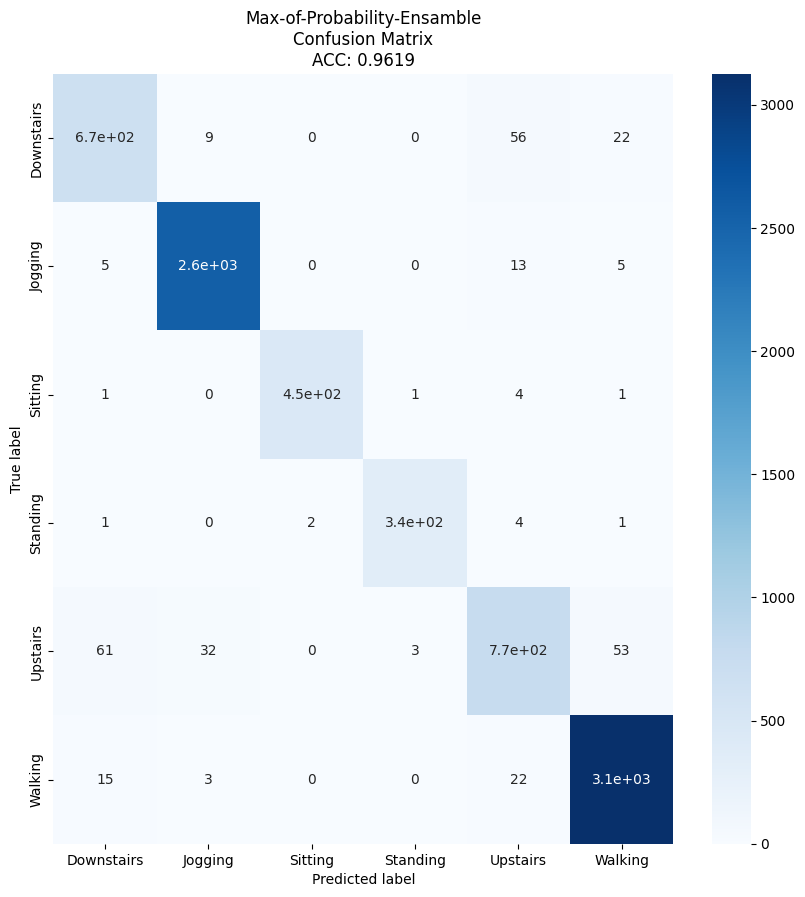  

### 各確度
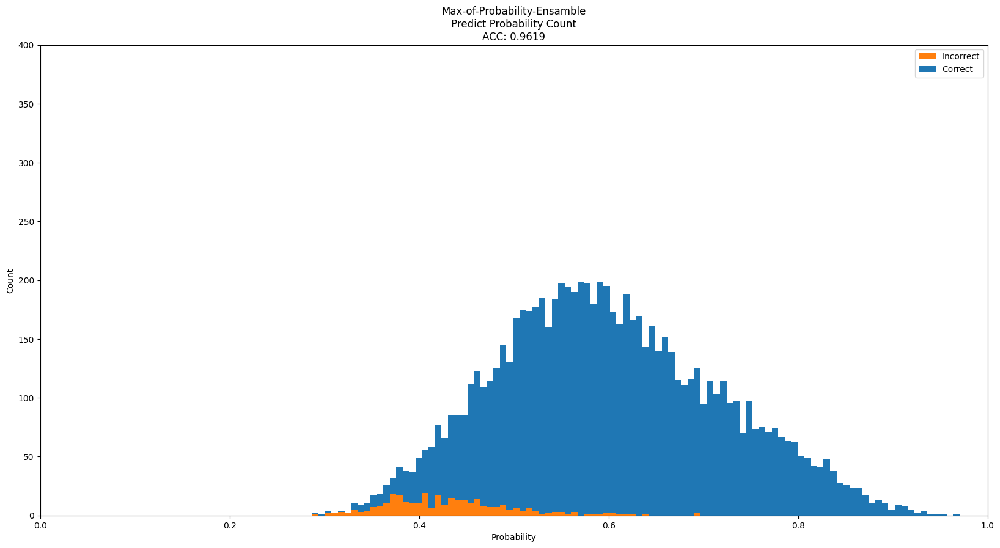  

### 累積確度
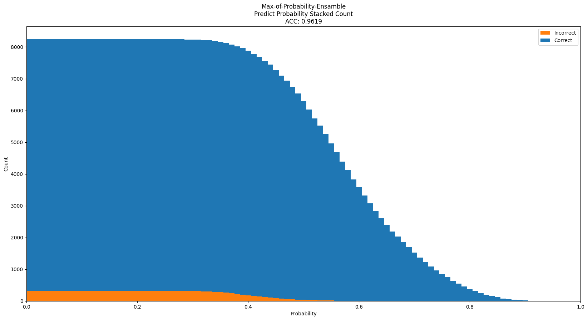  

| threshold | accuracy  | count |  
|-----------|-----------|-------|  
| 0.0       | 0.961879  | 8237  |  
| 0.1       | 0.961879  | 8237  |  
| 0.2       | 0.961879  | 8237  |  
| 0.3       | 0.961991  | 8235  |  
| 0.4       | 0.974610  | 7956  |  
| 0.5       | 0.992965  | 6539  |  
| 0.6       | 0.997646  | 3823  |  
| 0.7       | 1.000000  | 1690  |  

# アンサンブル-SEED-
## 使用するモデル

すべてConv.BackBone Transformerアーキテクチャを使用した。  
そのなかでtorchのSEEDを変更したモデルを3種類用意しアンサンブルを行う。  

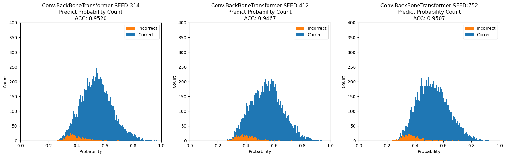  

## それぞれのモデルの出力データの解析
テストデータの数は8237個  
内、  
すべてのモデルが正解していたデータは7842個  
すべてのモデルが不正解であったデータは129個  
そのため、理想的な精度は98.43%となる。  
すべてのモデルが不正解であったデータのラベルの内訳は以下の通り。  

| Activity   | Upstairs | Downstairs | Walking | Jogging | Sitting | Standing |  
|-------|----|----|----|----|---|---|  
| Count | 50 | 36 | 17 | 16 | 6 | 4 |  

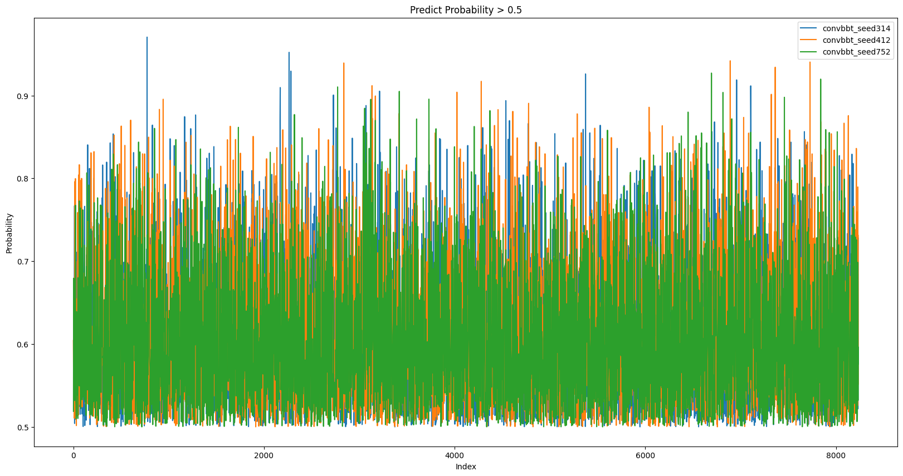  

## 方法1.確率分布の平均をとる
### 精度
  

### 各確度
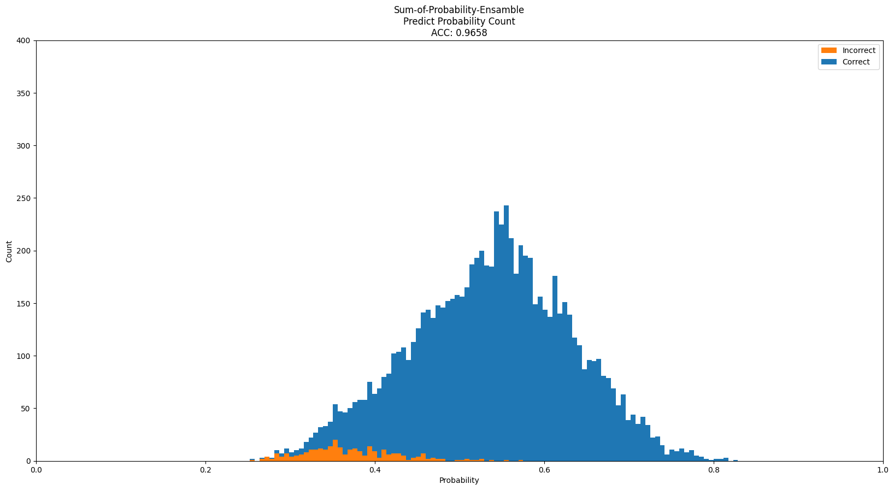  

### 累積確度
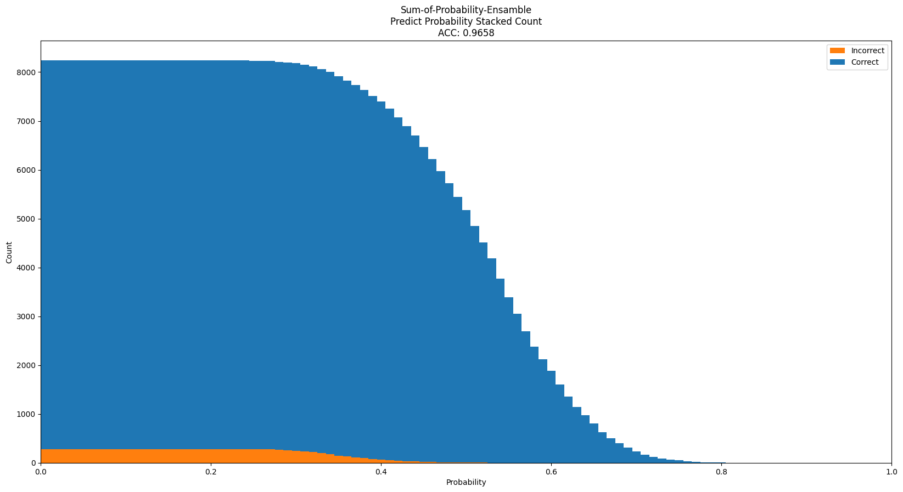  

| threshold | accuracy  | count |  
|-----------|-----------|-------|  
| 0.0       | 0.965764  | 8237  |  
| 0.1       | 0.965764  | 8237  |  
| 0.2       | 0.965764  | 8237  |  
| 0.3       | 0.969005  | 8195  |  
| 0.4       | 0.990017  | 7513  |  
| 0.5       | 0.997980  | 5446  |  
| 0.6       | 1.000000  | 2121  |  

## 方法2.多数決をとる
### 精度
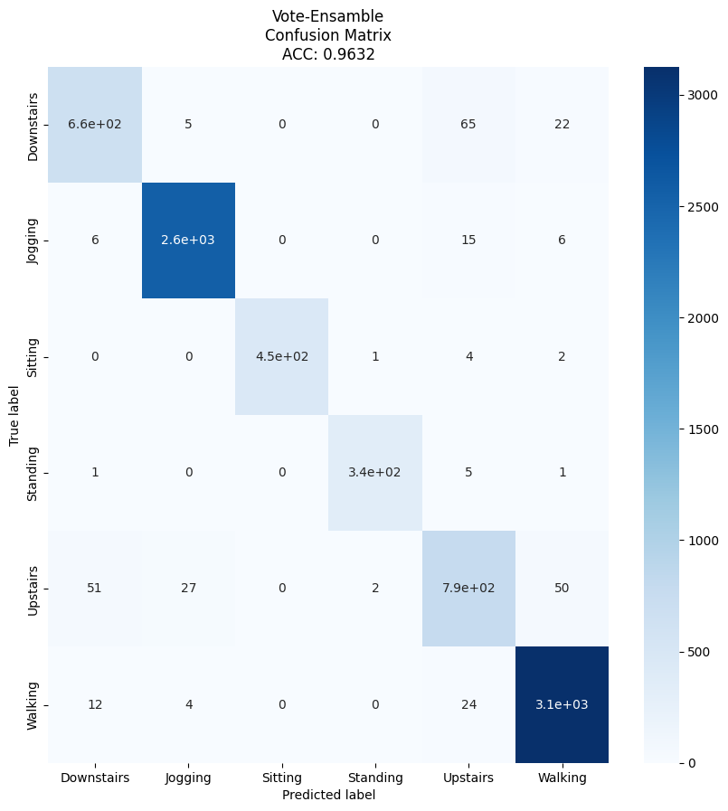  

### 各確度
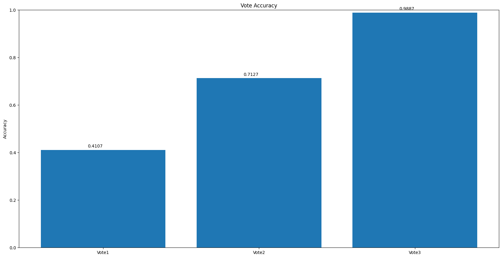  

### 累積確度
  

### 多数決票の内訳

| Description  | Number |  
|------------- |------- |  
| Vote 3 num   | 7537   |  
| Vote 2 num   | 644    |  
| Vote 1 num   | 56     |  
| Total        | 8237   |  

## 方法3.最も確度の高いものを採用する
### 精度
  

### 各確度
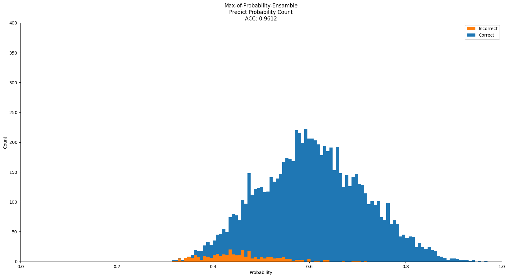  

### 累積確度
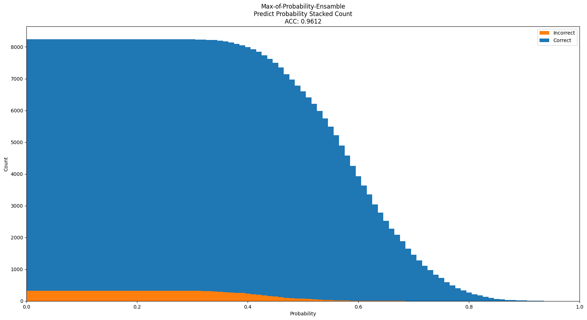  

| threshold | accuracy  | count |  
|-----------|-----------|-------|  
| 0.0       | 0.961151  | 8237  |  
| 0.1       | 0.961151  | 8237  |  
| 0.2       | 0.961151  | 8237  |  
| 0.3       | 0.961151  | 8237  |  
| 0.4       | 0.968952  | 8052  |  
| 0.5       | 0.988060  | 6784  |  
| 0.6       | 0.996941  | 4250  |  
| 0.7       | 0.998790  | 1653  |  
| 0.8       | 1.000000  | 335   |  

## 考察
精度の高い順番にならべると、以下のようになった。  
| Method                       | Accuracy   |  
|------------------------------|------------|  
| Sum of Probabilities         | 96.59%     |  
| Vote                         | 95.91%     |  
| Max of Probability           | 95.79%     |  

この結果は情報の欠落度と同じであり、違和感のない結果である。  
また、モデルそれぞれの確度をインデックスごとにプロットした図からも最も確度の高いものを採用する方法は1DCNNの寄与を大きく下げ、確度が絶対的にも高くない1DCNNをモデルに含めるためには情報の欠落が起こりやすいアンサンブル方法よりも確率分布の平均を取るほうが分散を下げることに成功したものと考える。  

また、予測困難と判断しデータを捨てた場合の99%以上の精度となる場合を評価すると、  

| Method                       | Confidence | Count | Accuracy   |  
|------------------------------|------------|-------|------------|  
| Sum of Probabilities         | 0.4        | 7241  | 99.07%     |  
| Vote                         | 3 vote     | 7236  | 99.41%     |  
| Max of Probability           | 0.6        | 3889  | 99.22%     |  

上表より、多数決をとるアンサンブルが確度の大きい場合において非常に精度が高く、自信の大きいデータも多い。  
確率分布を平均するアンサンブルについても同程度の結果を示している。  

また、アンサンブルを取ることによって精度が向上することについてはモデルのバイアスとバリアンスのトレードオフ関係にある。  
単一のモデルでは表現力の大きなモデルというのはバリアンスが大きく、バイアスの小さなモデルとなる。  
しかし、バイアスとバリアンスは共に小さいほうが望ましい。  
そこでバリアンスの大きいモデルでアンサンブルを取ることで、バリアンスとバイアスの両方が下がり精度が向上する結果となったと考える。  

より良いアンサンブルの結果を得るためにはランダムフォレストのアイデアを取り入れるのが良いかもしれない。  
ランダムフォレストのアイデアというのは、  
- ブートストラップで各モデルの学習データを決定する  
- モデルに温度を持たせて多様性を確保する  

温度を持たせることについてはモデルを別のものに変えることでも代用できると考えている。  

また、アンサンブルするモデルについての結果をまとめる。  
以下の3通り実験した。  
- まるごとアーキテクチャを変えたアンサンブル  
- 少しアーキテクチャを変えたアンサンブル  
- シードを変えたアンサンブル  

それぞれについて要約した結果を示す。  
confidence-lineは確度の低いデータを捨て99％の精度を達成できるライン、または全投票とした。  

|         | confidence-line | accuracy |  
|---------|-----------------|----------|  
| model   |                 |          |  
| AVE     | 7241            | 96.59    |  
| VOTE    | 7236            | 95.91    |  
| MAX     | 3889            | 95.79    |  
| layer   |                 |          |  
| AVE     | 7437            | 96.37    |  
| VOTE    | 7689            | 96.32    |  
| MAX     | 6539            | 96.19    |  
| seed    |                 |          |  
| AVE     | 7513            | 96.58    |  
| VOTE    | 7537            | 96.32    |  
| MAX     | 4250            | 96.12    |  

上表からわかることをまとめる。  
- accuracyに大きな差はない  
- 情報が大きく捨てられてしまうMAXは不安定  
- 似たモデルをアンサンブルに使ったほうがconfidence-lineは上がる  

指摘を受けたモデルごとの分布が揃っていない件についてだが、私はこのままで良いと考える。  
理由としては以下の2点がある。  
・CNNベースかTransformerベースかで分布が大きく異なるが、その2つには表現力に大きく差がありモデルのバリアンス・バイアスが分布に現れているためこれを無下にする変換は望ましくない  
・確度分布の閾値による予測の排除をしても精度は向上していないこと  

実験は行い、その上での判断であることを留意していただきたい。  

また、絶対値の大きな負の値との正規化することにより急な値になっていることが分かったため、分割平面のアイデアから負の値は不要であると考え、正規化前にソフトプラス関数（y=ln(1+e^x)）を適用し負の値の軽減を試みたがより悪化し急唆な出力となってしまった。  
