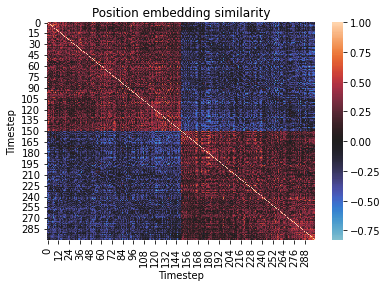

# Wearable Sensor-Based Human Activity Recognition with Transformer Model

2022年に発表されたKU-HARデータセットについてTransformerを適用した論文。  

執筆時点ではBiLSTMという双方向にLSTMを用いたNNモデルがWISDMデータセットにおいて良いスコア（ACC:96.54）を出しているらしい。  

また、Transformerについて利用するメリットについては計算速度と拡張性であると記載されていた。  

加工後のKU-HARデータセットはスマホから収集された1次元（300）・6チャネルのデータセットである。  
この6という数字はパッチ数に対応しており、1800個を->300×6としているのでP=300のViTとも解釈可能である。  

ラベルはWISDMデータセットと同じ「立つ」、「座る」、「歩く」だけでなく、「立つ座るを繰り返す」、「卓球」などを加えた計18クラスになっている。  

サンプル数は20750個で、データ拡張を行うことで83129個のデータにしている。  

データ拡張について、300個のサンプルについて合成を行い使用したサンプルラベルを並べたものを新ラベルとして使用する。  
つまり、今回の場合には300個のラベルを並べたものが新ラベルとして用いられる。  

TransformerのハイパーパラメータについてはWanDB Sweep Toolを用いて探索したとあり、ACCを最大化（ACC:0.992）する方向に進めている。  

以下の表は探索結果のハイパーパラメータの表である。  

|        params        | Epochs | Attention Dropout rate | Batch size | MLP Dropout rate | Embedding size | MLP Layer size | head | layers | Adam's learning rate |  
|---------------------------|--------|-----------------------|------------|------------------|----------------|----------------|------|--------|----------------------|  
| Value             | 50     | 0.1                   | 64         | 0.1              | 128            | 256            | 6    | 3      | 0.001                |  

合計パラメータ数は1,428,127個であった。  

学習後の位置エンコーディングの画像が以下である。  
  

### ソースコード
https://github.com/markub3327/HAR-Transformer  

### データ
https://www.kaggle.com/datasets/niloy333/kuhar?resource=download  

### 元論文
https://paperswithcode.com/paper/wearable-sensor-based-human-activity  
