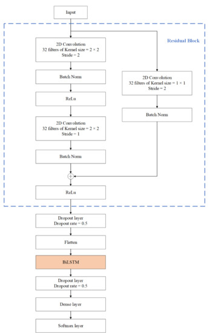
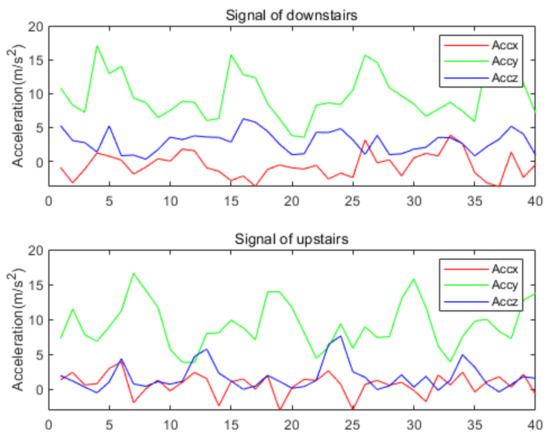

# Human Activity Recognition Based on Residual Network and BiLSTM

2022年に発表されたBiLSTMとCNNを組み合わせたモデルを提案した論文。  

構造としては残差写像としてCNNを使用し、Flattenした後にBiLSTMをかけたもの。  
画像は論文から引用。  
  

BiLSTMは順方向と逆方向の2つの方向についてLSTMで計算したものを並べたもの。  
活性化関数はtanhであった。  

データの前処理として正規化（ノンパラメトリックな軸方向の層正規化）をしている。  

結果として今回の実験でSoTA（ACC:97.32）を達成した。  

「Walking」以外の加速度計から生成されるデータは似ているため混同されやすいとあった。  
以下は「Upstars」と「Downstars」だが確かに人の目では見分けがつかない。  

  

従来のモデルとの比較も行われていた。  
以下に表を示す。  

|model|CNN|TSE-CNN|SC-CNN|CNN-GRU|LSTM-CNN|BiLSTM-CNN|  
|-----|---|-------|------|--------|---------|--------|  
|ACC(%)|93.32|95.7|97.08|97.21|95.01  |97.31          |  
|params| -|9223|-|1176972|-|62598|71462              |  

## 元論文
https://www.mdpi.com/1424-8220/22/2/635  
