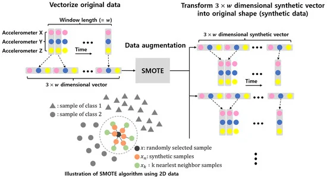
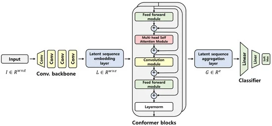

# Inertial-Measurement-Unit-Based Novel Human Activity Recognition Algorithm Using Conformer

2022年に発表されたConformerをHARに適用した論文。  
2023/6月に調査した限りではこのConformerがSoTA（Acc:98.1%）であった。  

ConformerはConvolutuional+Transformerという意味。  
その名の通り、畳み込み演算を従来のTransformerの構造に加えたもの。  

Conformerは音声認識の分野でSoTAを達成したモデルであったがHARでもSoTAを達成した。  

処理としてはSMOTE（後述）によってデータ拡張を行い、データのサンプル数を増やす。  
その後、Conformerにて学習・推論を行う。  

SMOTEについて。  
SMOTEはthe synthetic minority oversampling techniqueの略。  

アルゴリズムは以下の通り。  

0. 複数チャネルのデータの場合には下の画像のようにFlattenする。  
1. クラスCkについてサンプル一つを選ぶ。（0≦ｋ≦5）  
2. KNN(K=10)によってxkを生成する。  
3. xn=x + random(0,1)×|x - xk|によって新サンプルxnを生成しCkに加える。  
4. クラスCkのサイズがN(=12000)になるまで1-2を繰り返す。  

結果、概算ではあるが27454個のデータを12000×6=72000個のデータに拡張することができる。  

  

論文にSMOTEによって拡張したデータと拡張していないデータでそれぞれ学習させた場合のスコアがTable2に記載されていた。  
そこではConformer、Transformer、1D-CNNがモデルとして例示されており、いずれもSMOTEでデータ拡張を行ったデータで学習を行ったほうが精度が高かった。  
つまり、一般に（少なくともHARのWISDMデータセットにおいては）学習をさせる際にこのデータ拡張を行ったほうが良さそうである。  

Conformerについて。  

Conformerのアーキテクチャ。  

  

アーキテクチャ以上の説明は特にないが、チャネルがdで普段のdがwになっている。  
Transformer的に言い換えるとトークン数がdでトークン長がwである。  

これをViTのハイブリットと同じ要領で特徴量抽出、埋め込みを行い、Conformer層に渡している。  
Conformer層のFFNは1/2倍してから残差写像に用いている点は注意が必要かもしれない。  
その後、Conformerから出力されたシーケンスをLatent sequence aggregation層でベクトルに変換する。  
最後にFFN（隠れ層活性化関数GERU、出力層Softmax）でクラス分類を行う。  

ハイパーパラメータ探索はグリッドサーチを用いている。  
探索結果を以下の表に示す。  
| param | dim | head | block | FFN expand factor | Con expand factor |Dropout rate| batch size |  
|-------|-----|------|-------|-------------------|-------------------|---|------------|  
| num   | 256 | 16   | 8     | 2                 | 2                 |0.1|     8     |  

expand factorはdimと比べた隠れ層の相対的な大きさのことなのかと思う。  
（論文には説明見つけられなかった）  

Conformerの場合Blockの数が2個で良いというのは注目すべきポイントだろう。  

また、Con expand factorはチャンネルの拡張率を表しており、6チャンネルに拡張しているということになる。  
ViTでは16チャンネル程度を扱っており、Attention is All You NeedでのTransformerでは26チャンネル程度であることからこの論文では、ずいぶんと少ないチャンネル数に拡張していることが分かった。  
（Attention is All You Needについては画像のAttention Visualizationsを参考にした。）  

結果としてConformerモデルで98.1%（データ拡張後）、Transformerモデルでも97.9%（データ拡張後）のスコアを叩き出し、SoTAを達成した。  

## 元論文
https://www.mdpi.com/1424-8220/22/10/3932  
