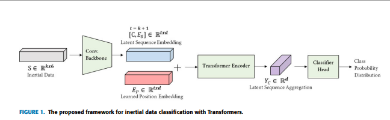

# inertial-based human activity recogniton with transformers

2021年に発表された論文。  

被引用数は18件で、ACCは89.6%と精度は高くはないがTransformerを使用したユースケースとして有用であると判断した。  

以下はTransformerのアーキテクチャである。  

  

前処理について、  
Conv．Backboneでは、4層の畳み込み層（活性化関数はGERU）で埋め込みを行う。  
それにBERTと同じxclsを加え、  
位置エンコーディングは学習可能な埋め込みを用いている。  

ハイパーパラメータは以下の通りであった。  
ハイパーパラメータ探索方法・探索結果については記述がなかった。  

|params|d|L|head|Dropout rate|  
|------|-|-|----|------------|  
|value |64|6 |8 |     0.1    |  

### ソースコード

https://github.com/yolish/har-with-imu-transformer  

### 元論文
https://ieeexplore.ieee.org/document/9393889  
