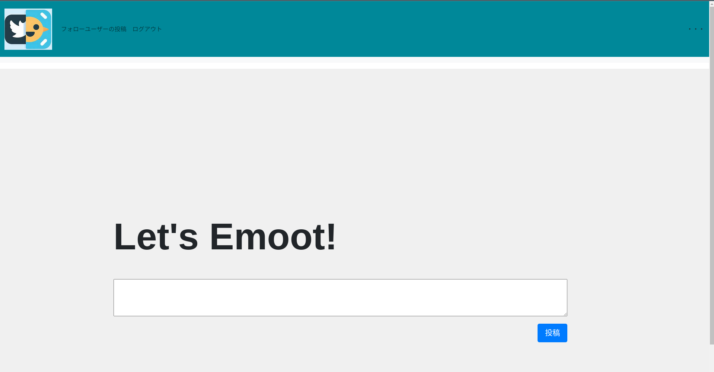

# 概要
JPHACKSという日本最大の学生向けハッカソンに参加した。  
内容としては作品のテーマは自由、２日間で動く製品を作成し、デモ発表を行うというもの。  
私達は「チーム鳥取大学」として三人チームで参加し、感情×Techのサービス「Emotter」を開発した。  

# 役割分担
役割分担は、内容をSNS部分と感情認識部分に大きく分割し他2人に分配、私はインテグレーターとして全体の進捗を管理しつつ他2人が詰まっている部分の補佐とプレゼンを行なった  

# 作成物
Emotterは完全なTwitterオマージュのSNSであり、画像認識・自然言語処理を用いた感情認識システムにより直接のコミュニケーションに近い新感覚のSNSとなっている。  

## サービスの流れ
Emotterの投稿までの流れを示す。  
まず、以下の投稿フォームに投稿内容を書き込む。  
  

投稿内容が書き終われば、投稿ボタンを押す。  
すると、WEBカメラが起動し、投稿者の顔が撮られる。  

その後、写真をデータURLに変換し、投稿内容と共にサーバにPOSTされる。  

POSTされた画像と投稿はそれぞれ機械学習モデルに通され、ネガポジ判定が行われる。  

そして、投稿内容、それぞれの感情認証結果がデータベースに保存される。  
（画像はこの時点で破棄される。）  
この感情認証結果と投稿内容のセットのことをエモートと呼ぶ。  

タイムラインにはこの感情認証結果が一致したエモートのみ表示され、悪意のある投稿は排除される。  

以上がEmotterの一連の流れである。  

## ソースコード
ソースコードはGitHubにアップロードしている。  

https://github.com/rakawanegan/Emotter  

## デモ動画
デモ動画はYouTubeにアップロードしている。  
（デバッグモード時に私の顔が写っているので非公開にしているかもしれない。）  

https://www.youtube.com/watch?v=YF6t8Mepq1A  

## 技術スタック
技術スタックとしては、以下を用いた  
- Django：PythonベースのWEBアプリ開発用フレームワーク  
- FER：表情認識のPythonモジュール  
- BERT：日本語モデルを東北大学が提供の感情分類データセットを用いファインチューニング  

苦戦した部分としては、顔画像をデータURIに変換しPOSTを行う箇所がDjangoでは実装困難であった為、ChatGPTの力を借りながらではあるが、無学のJava Scriptで書いたことである。  
残念ながら初日はこの処理をする部分で詰まってしまい進捗が思ったように進まなかった。  

GitHubのリポジトリに学習済みモデルを生成するコードが入っているが、再現性の担保の為、学習済みモデルを一定期間Google Driveにアップロードしておく。  

https://drive.google.com/drive/u/0/folders/1x91HepGToqNp_h2tSSycvnFx98bzjMp2  

# 振り返り
JPHACKSへの参加を通じて、チームワークや他人への依存の難しさを痛感した。  
しかし、この経験を通じて、エンジニアとしてのスキルの底上げが出来たと思う。  

反省点としては、タイムラインやアクションプランが不明確であったせいで当日バタバタしたこと、分業がはっきりできていなかったことで1人に大きな負担を強いてしまったことがある。  

総括として、2日間でサービスを構築するというハードで貴重な経験を積むことができた。  
