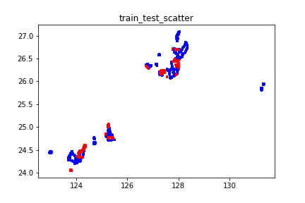
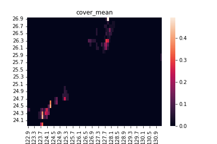
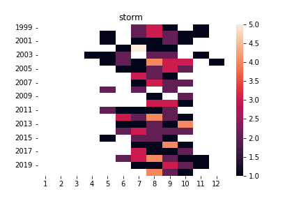
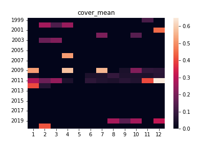

# 問題概要
千葉工業大学 人工知能・ソフトウェア技術研究センター主催のAIコンペティション「ブルーカーボン・ダイナミクスを可視化せよ！　〜沖縄県沿岸の水深・水温等の環境条件のデータから、海草藻場の被度を予測しよう！〜」がSIGNATEにて開催された。  
上位三位までは賞金と2023年度人工知能全国大会 (JSAI2023)出場、登壇権利が得られる。  

# 結果
研究室メンバーと計4人で参加し、391人投稿中で302位であった。  
かなり渋い結果となった理由としては、  
- コンペティション初参加  
- 開催期間の半分の1ヶ月のみでの挑戦  
- 衛星画像のランドマークと入力の解釈が難しい  

# 入出力
訓練データが14140個、テストデータが4039個。  
入力  
- 被度文献データ(緯度経度、年月日、気象情報)  
- 海洋環境要因データ  
- 2019年に撮影された衛星センチネル画像テーブルデータ  
- 被度文献データの年月日に最も近い衛星ランドサット画像テーブルデータ  
- 2000からの2020年までの衛星ランドサット画像テーブルデータ  

出力  
- 沖縄の指定された地点の藻の被度  

評価指標  
- RMSE：平均二乗偏差  

# データ分析
訓練データとテストデータの分布を確認するため緯度経度で散布図を作成した。  
青が訓練データ、赤がテストデータを表す。  
  

緯度経度による目的変数の分布の偏りを確認するために、ヒートマップを作成した。  
目的変数の値が大きいピークの地点が2点ほど存在することがわかる。  
  

台風が来た年には大きく目的変数が減少することがあると考え、気象庁から台風情報を取得した。  
台風の回数を値とした年月でのヒートマップ。  
  

目的変数の平均値を値とした年月でのヒートマップ。  
  

訓練データとテストデータに大きな差異がないかを確認するために訓練データか否かのラベルを目的変数としたモデルを作成した。  
モデルはLightGBMで作成し、正答率が99.67%と非常に高い結果となった。  
しかし、この事実は締め切り一週間前に得られた為、具体的アクションプランが立たないままクローズとなった。  

# 使用したモデル
- LightGBM  
- 全結合ニューラルネットワーク  
- 最近傍法  

以上のモデルから、重み付き平均のアンサンブルを作成した。  
また、全結合ニューラルネットワークに入力する値は正規化を施し、  
LightGBMには被度文献データｍ衛星画像のRGB値を  
最近傍法には緯度経度、年月を入力した。  
提出したモデルは、LBの値を比較しながらアンサンブル比を調整した。  
（これが順位を大きく落とす結果となった。単一のモデルであれば49位のモデル。）  

# 工夫した点
コンペティション初参加で手探りが多かったが、形になるものをでき及第点と考えている。  
衛星画像データの欠損値の補完についてはチームメンバが作成した。  
方法としては、入力対象の衛星画像の欠損値を前後年の値から線形補間を行う。  

# 他参加者から吸収したこと
14位  
- Linear Quiz Blending：アンサンブル方法  
すべて0のLBスコア、複数の予測値-LBスコアペアから適したアンサンブル比を計算できる  

3位  
- 地点を均等に学習するようにグループFoldを作成する  
- 欠損の有無を特徴量にする  
- モデルの安定性が着実にスコアを上げるために必要  

2位  
- 目的変数の分布からTweedie分布を仮定し評価指標を作成  
- 提供データの値の粒度が均一でないことを考慮した意図的な丸め  
- メッシュごとの上位10％の平均値を特徴量に加える  
- CVとLBの差を確認し、CVを信じる  
- PublicLBとPrivateLBの差が大きい緯度経度の値はを考えすぎない  

1位  
- どのような場合に目的変数の値が大きくなるのか想定する  
- 生育しない条件を予測するモデルの為、最も過酷で現実に近そうな最小値を採択する  

# ソースコード
https://github.com/rakawanegan/bluecarbon_portfolio  
