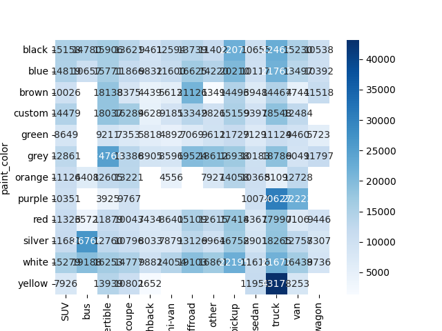
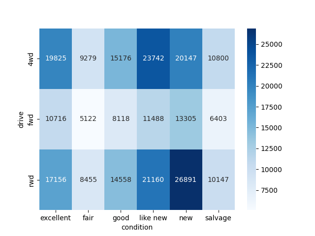
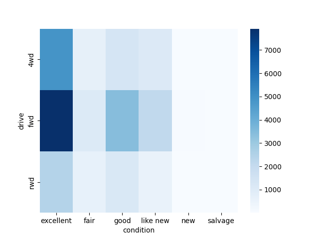
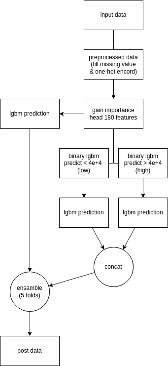

# 問題概要
SIGNATE主催の学生限定コンペ  
内容はテーブルデータから中古車価格を予測するというもの。  

# I/O
訓練：27532  
テスト：27537  
評価指標：MAPE  

| Index | Column        | note                |  
|-------|---------------|---------------------|  
| 0     | region        | 車を販売する地域    |  
| 1     | year          | 車の製造年          |  
| 2     | manufacturer  | メーカー名          |  
| 3     | condition     | 車の状態 |  
| 4     | cylinders     | シリンダー数 |  
| 5     | fuel          | 燃料タイプ |  
| 6     | odometer      | 走行距離             |  
| 7     | title_status  | タイトルの状態 |  
| 8     | transmission  | トランスミッションタイプ |  
| 9     | drive         | 駆動方式 |  
| 10    | size          | 車のサイズ           |  
| 11    | type          | 車のタイプ           |  
| 12    | paint_color   | 車の塗装色           |  
| 13    | state         | 販売州               |  

# 結果

順位は奮わず101/379人であった。  
しかし、努力賞として以下のものを頂いた。  
- モデリング部門特別賞  
- Slackアクティブ賞  

# EDA
## 価格の高い組み合わせ
トラックが平均して価格が高く黄色のトラックが最も高い組み合わせ  
  

新品の後輪駆動が価格が高い傾向にある  
  

しかし、データ数を確認すると極端に数が少なく平均価格が引っ張られたに過ぎなかった。  
  

## 存在し得ないハイブリッドカー
1997年10月に初めてハイブリッドカーをトヨタが発表したとのこと。  
しかし、ハイブリッドカーの製造年の最小値を確認すると1975年となっていた。  
これはデータ拡張をすでに行ってデータを作成したことに起因するのだと考えるが、具体的にどう対処すればよいのかはわからなかった。  

# 使用したモデル
- LightGBM  
- TabNet  
- 最近傍法  

TabNetと最近傍法はあまり効かず、モデルに採用したのはLightGBMのみであった。  

残差接続をイメージしてスタッキングを行った。  
以下に処理の流れを示す。  

  

# 工夫した点
欠損値と外れ値の処理方法を工夫した。  
- 走行距離が欠損の場合、車年齢と年平均走行距離から線形に補完  
- regionからstateを特定しstateを補完  
- 走行距離が100万の単位のものは桁の打ち間違いと考え1/10した  
- 製造年が3000年代のものは-1000した  
- 新車かつ廃車のようなデータは廃車に揃えた  

 また、特徴量エンジニアリングとして、カテゴリ変数については可能な限り順序尺度に変換した。  

# 他参加者から吸収したこと
学生部門1位  
- MAPEは相対誤差の為、下に外すことを少なくするようにモデリングする  

社会人部門2位  
- ダミー変数をつける場合に順番を意識することで疑似ターゲットエンコーディングにする  
- メタモデルを作成し、モデルを使い分けることで目的変数の多峰性に対応する  

社会人部門1位  
- ユニーク数が多いカテゴリ変数にはターゲットエンコーディングを行う  

# ソースコード

https://github.com/rakawanegan/signatestudentcup2023_portfolio  
